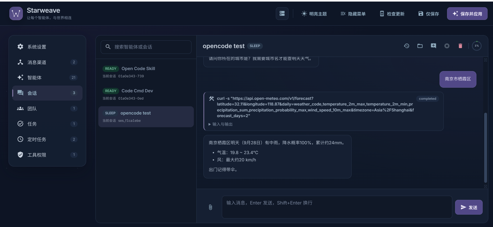
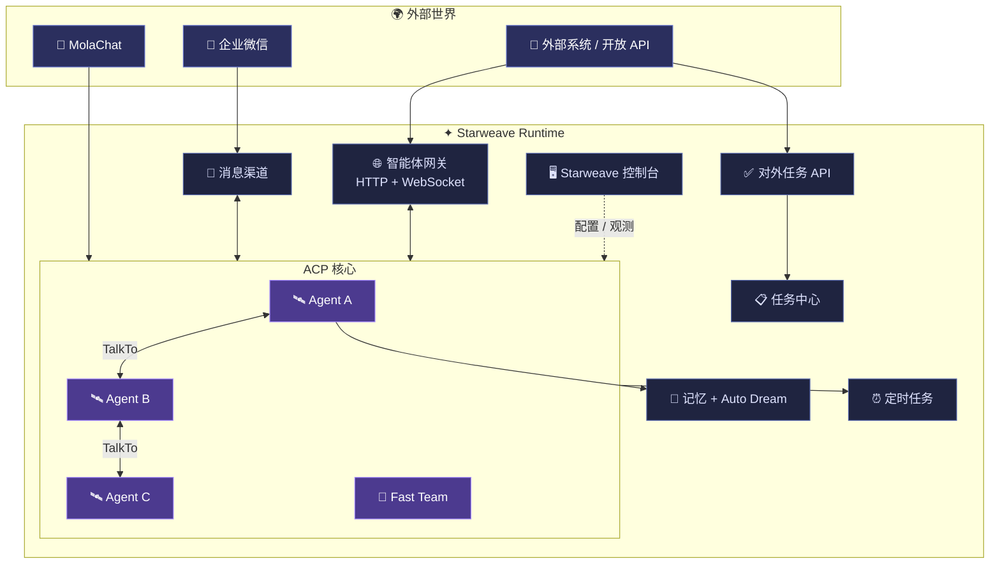
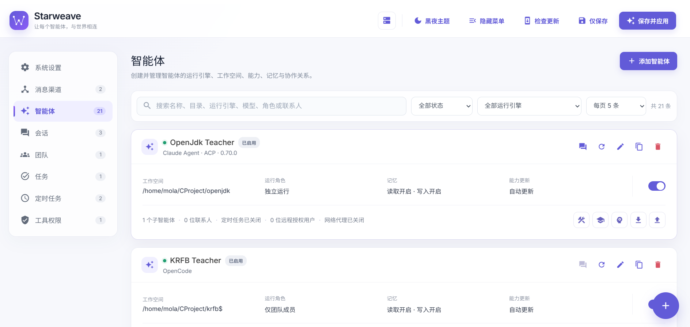
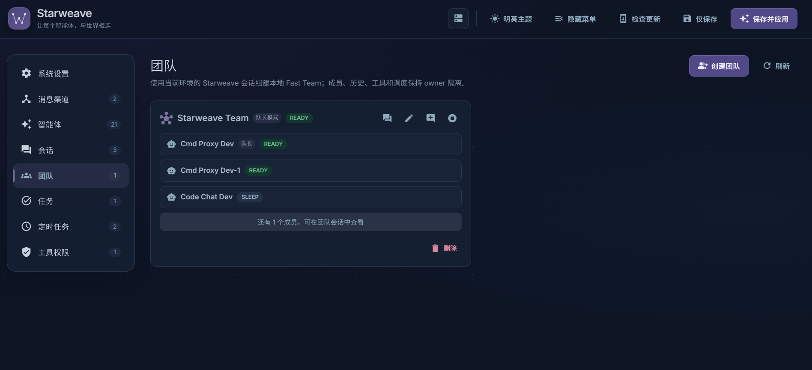
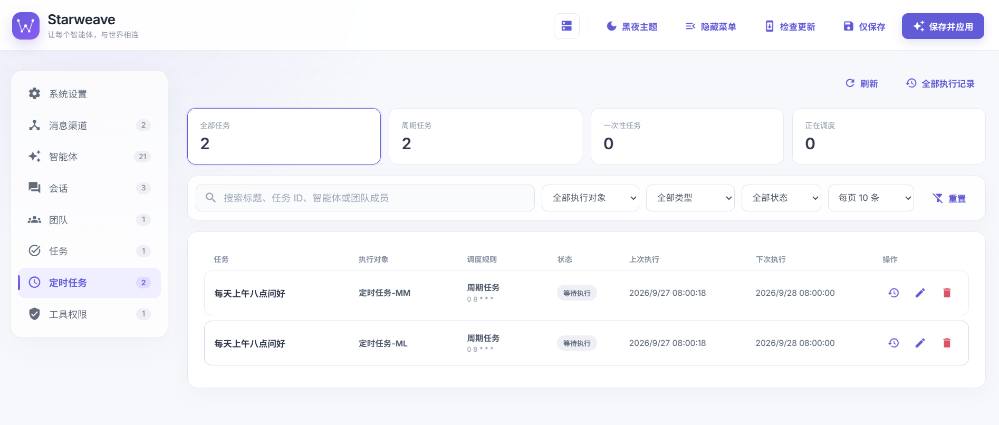
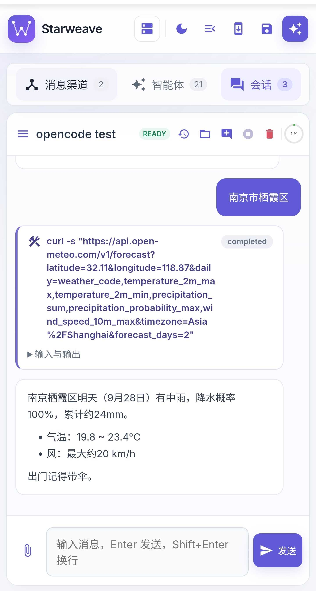

<div align="center">



# ✦ Starweave

### 让每个智能体，与世界相连

**把散落各处的 AI 编码助手，编织成一支会记忆、能协作、可调度、连世界的智能体舰队。**

一个面向 ACP（Agent Client Protocol）的本地智能体运行时：统一托管多种编码智能体引擎，
让它们像同事一样互相沟通、组队协作、记住上下文、按时上班、接入企业微信，并在一个漂亮的
Web 控制台里被观测和编排。

[](https://adoptium.net/)
[](https://kotlinlang.org/)
[](https://maven.apache.org/)
[](https://nodejs.org/)
[](https://modelcontextprotocol.io/)
[](https://agentclientprotocol.com/)

</div>

---

## 🌌 这是什么？

你大概已经体验过：Claude Code、Codex、OpenCode 各自都能干得不错，但它们彼此不认识，
每次开新会话都要重新交代一遍背景，到点了也不会自己起床干活，更别提替你接待企业微信里的同事。

**Starweave 要做的，就是在这些引擎之上，织一张网。**

“Starweave” = Star（每一颗独立的智能体之星）+ Weave（把它们编织在一起）。
它不替代任何编码助手，而是在它们外面加了一层**运行时**：托管进程、隔离工作空间、
打通互相通信、补上长期记忆与定时能力、接上外部渠道，最后用一个统一控制台交付给你。

> 一句话理解：**ChatGPT 们各自为战，Starweave 让它们成为一支队伍。**

---

## 🚀 亮点速览

| | 能力 | 一句话 |
|---|---|---|
| 🛰️ | **多引擎编队** | Kiro CLI / OpenCode / Claude Agent · ACP / Codex · ACP / DeepSeek Harness · ACP，同一控制台混编 |
| 💬 | **TalkTo** | 智能体之间异步互发消息，发完就走、可双向回复，复用彼此的完整上下文 |
| 👥 | **Fast Team** | 多个智能体临时组队，普通模式全员互通，队长模式星形指挥 |
| 🧩 | **子智能体并行** | 一键把独立任务扇出给多位专家并行执行，再聚合回主智能体 |
| 🧠 | **长期记忆 + Auto Dream** | 跨会话记住你的偏好与项目决策，并在后台自动整理、去重、纠错 |
| ⏰ | **定时任务** | 用自然语言让智能体「每天八点问好」，周期 / 一次性都支持 |
| ✅ | **任务中心** | 任务变成可追踪、可分配、可回写的一等实体，还开放对外创建 API |
| 📡 | **外部信道** | 企业微信双向接入，消息先归档再投递，可检索、可审计 |
| 🌐 | **智能体网关** | 把真实会话以结构化事件流 + HTTP/WebSocket 暴露给外部系统 |
| 🖥️ | **Starweave 控制台** | 暗夜主题、响应式、移动端可用的可视化配置与观测中心 |

---

## 🧭 能力全景



---

## 🛰️ 多引擎智能体编队

一个环境里可以同时托管多个智能体，每个都有**独立的运行引擎、工作空间、模型、权限与记忆策略**。
它们既可以是“独立运行”的主角，也可以配置为“仅子智能体”或“仅团队成员”。

<div align="center">

<sub>智能体列表：引擎、工作空间、记忆开关、子智能体与联系人一览无余</sub>
</div>

支持的开箱引擎：

| 引擎 | 说明 |
|---|---|
| **Kiro CLI** | 兼容 ACP 的本地 CLI 智能体 |
| **OpenCode** | 按工作目录隔离，可搜索可手输的模型目录 |
| **Claude Agent · ACP** | Claude Code 的 ACP 桥接 |
| **Codex · ACP** | OpenAI Codex 的 ACP 桥接（按 Codex Home 跨工作目录共享模型目录） |
| **DeepSeek Harness · ACP** | DeepSeek Harness，内置标准 / PTC / 极简 / 创造多套预设 |

---

## 💬 TalkTo：智能体之间，也会聊天

传统的“子智能体”是**阻塞式**的：主智能体派活后只能干等结果。
TalkTo 是另一条通道——**异步、双向、非阻塞**：

- A 给 B 发消息后立刻继续手上的工作，**不需要等**；
- B 在自己的完整会话、记忆与工具链里处理，完成后可以**主动回复** A；
- 复用 B 的主会话上下文，而不是新开一个“失忆”进程。

```jsonc
// 智能体内部通过 MCP 工具调用，异步发出
{ "target": "Code Chat Dev", "content": "帮我查一下 WebSocket 重连有没有处理 token 过期，查完告诉我" }
```

目标忙碌时消息自动入队，对方空闲后按批处理；目标在睡觉（SLEEP）则先被温柔唤醒。

**防风暴由服务端强制**，不靠模型自觉：

| 护栏 | 阈值 |
|---|---|
| 单条通信链最大跳数 | **5 跳** |
| 单链消息总数 | **12 条** |
| 单发送者上限 | **5 条** |
| 单一方向上限 | **5 次** |
| 通信链存活时间 | **2 小时** |
| 重复内容窗口 | 60 秒去重 |

还支持跨环境通信——把目标写成 `{chatterId}:{robotName}`，消息就会经网关路由到另一台
cmd-proxy 上的智能体，对模型完全透明。

---

## 👥 Fast Team：临时组队，并肩干活

从控制台挑几个智能体、起个队名，`Starweave` 会为**每个成员创建一套独立的 ACP 会话**
（独立进程、独立历史），让它们带着临时通讯录协同作战。会话与主会话完全隔离，互不污染。

<div align="center">

<sub>Fast Team：成员状态、队长模式与团队级操作集中展示</sub>
</div>

**两种协作拓扑：**

- 🟢 **普通模式**：全员互通，谁都能联系谁，适合头脑风暴与自由协作。
- 🔵 **队长模式**：星形拓扑——队长可联系所有队员，队员只能联系队长，且**互相不可见**。
  外部信道与任务在队长模式下也只由队长承接，天然形成指挥链。

**边界与配额（可在服务端配置）：**

| 限制 | 默认值 |
|---|---|
| 每实例活跃团队 | 20 |
| 每队成员数 | 1 – 10 |
| 实例成员总数 | 100 |

还支持**本机 + 多个远程实例混选组队**：至少一个本机成员，消息经 MolaChat 网关跨实例路由，
同名智能体也不会串线。

---

## 🧩 子智能体：把任务扇出去

当任务可以被拆成若干互不依赖的部分时，主智能体可以一次性派发给多位专家**并行执行**，
结果聚合后再进行第二轮汇总推理。

```
📋 正在派发 2 个子 Agent 任务...
🚀 [搜索专家] 开始执行...
🚀 [代码审查专家] 开始执行...
✅ [搜索专家] 完成 (耗时 3.2s)
✅ [代码审查专家] 完成 (耗时 5.1s)
📊 所有子 Agent 已完成，正在汇总结果...
```

- 跨工作区、跨技能、跨记忆：项目 A 的主智能体可以调用项目 B 的专家。
- 白名单强校验、单任务超时（默认 120s）、整体超时、可整体取消。
- 进度实时推送，长任务每 30 秒回传一次状态快照。

> **阻塞式子智能体 + 非阻塞式 TalkTo**，Starweave 同时给你两种协作节奏。

---

## 🧠 长期记忆：越用越懂你

Starweave 为每个智能体维护一套**可读、可编辑、可导出**的长期记忆：

- 采用「索引概要 + 明细分文件」两层结构：概要常驻提示词，明细按需读取，避免上下文膨胀。
- 四类记忆：`user`（用户画像）、`feedback`（行为反馈）、`project`（项目上下文）、`reference`（外部引用）。
- 按项目隔离（`~/.cmd-proxy/memory/{workspaceHash}/`），另设跨项目全局记忆。
- 提取与整理都由**独立的子 Client** 异步完成，不打扰主线对话。

**Auto Dream** 是记忆的“睡眠整理”机制：定期唤醒一个后台智能体，对已有记忆做
**去重、合并、矛盾消除、过期清理、相对日期规范化**，让记忆随时间越睡越清晰。
触发双门控：距上次整理 ≥ 24 小时 **且** 累积 ≥ 5 个会话。

---

## ⏰ 定时任务：让智能体按时上班

用自然语言说一句「每天上午八点问我好」，智能体就会通过内置 MCP 工具把任务落盘，
由调度线程每分钟扫描，到点后在**自己的新会话**里执行。

<div align="center">

<sub>定时任务看板：周期 / 一次性、上次执行与下次触发一目了然</sub>
</div>

- 支持 `cron` 周期任务与 `once` 一次性任务（ISO 时间戳或 `+30m` 这类相对时间）。
- 可按 `groupName` 复用会话，支持 `daily-{yyyyMMdd}` 这样的日期模板，同一天共享、跨日自动切换。
- 任务由智能体自己管理：随时 `list` / `cancel` / `update`。

---

## ✅ 任务中心与对外任务 API

把「任务」从对话里抽出来，变成一个**有状态、有版本、有历史的一等实体**：

- 五态流转：`START → IN_PROGRESS → COMPLETED / CANCELLED / SUSPENDED`。
- Markdown 正文与备注、附件、按修订号的快照历史，冲突时返回版本校验错误。
- 可分配给具体智能体，也可分配给团队（固定 / 随机一次 / 任务亲和三种分配策略）。
- 独立的 `starweave-tasks` MCP 服务只暴露三个工具：`get_task`、`update_task_status`、`add_task_comment`。

**对外任务 API** 让外部系统也能创建任务：

```bash
curl -X POST http://localhost:10528/api/external/v1/tasks \
  -H "Authorization: Bearer <你的鉴权码>" \
  -H "Idempotency-Key: order-2026-0001" \
  -H "Content-Type: application/json" \
  -d '{"name": "处理线上告警", "content": "排查并给出根因分析"}'
```

每个接口拥有独立鉴权码与固定目标，幂等键保证同一请求不会重复派发。

---

## 📡 外部信道：把智能体接到企业微信

首批外部信道实现了**企业微信智能机器人**的 WebSocket 长连接：

- 企微消息以 TalkTo 来信形式投递到绑定的智能体，回复自动回到原会话（单聊 / 群聊均支持）。
- 敏感信息不下发：`secret`、`userid`、`chatid` 等被替换为不透明回复令牌。
- 消息**先落库、再去重、再投递**，数据库写入失败即拒绝投递（fail-closed），绝不静默丢消息。
- 控制台内置**消息记录检索**：按关键字、发送者、会话、类型、附件、状态与时间范围组合查询，
  详情展示脱敏载荷与处理时间线。

---

## 🌐 智能体网关：把会话变成可编程接口

想让外部系统驱动一个真实智能体？启用**智能体网关**，它会：

- 绑定一个运行中的目标会话（Starweave 主会话 / Fast Team 成员 / MolaChat 主会话）。
- 在同一个共享端口上同时提供 **HTTP API 与 WebSocket 事件流**，Bearer 鉴权。
- 把文字增量、工具调用、子智能体、定时任务、TalkTo、任务卡片、错误与完成状态，
  **统一投影为版本化结构化事件**，断线可续传、事件可去重、慢消费者被隔离。

网关是已有会话的一个新“传输面”，不复制会话、不伪造用户——所有在线端的改动彼此可见。

---

## 🖥️ Starweave 控制台

一个随服务启动的 Web 控制台（默认 `http://localhost:10528`），把整套运行时变得可视、可点、可调。

<div align="center">
<table>
<tr>
<td width="62%" align="center">

<sub>会话工作台：结构化工具卡片、附件与流式输出</sub>
</td>
<td width="38%" align="center">

<sub>移动端同样顺手</sub>
</td>
</tr>
</table>
</div>

- 功能分区：**系统设置 · 消息渠道 · 智能体 · 会话 · 团队 · 任务 · 定时任务 · 工具权限**。
- **黑夜主题**：午夜蓝为底、灰蓝为内容、雾钢蓝为交互，品牌紫作点缀。
- **响应式**：PC 单行紧凑列表，移动端自动切换卡片布局。
- 热更新：改智能体、信道、配置后一键保存并应用，无需重启进程。

---

## 🧰 内置 MCP 工具：`acp-harness-runtime`

Starweave 以一个常驻 MCP Server 的名义（名称 `acp-harness-runtime`）向智能体提供能力，
通过 **Streamable HTTP** 在本机环回地址暴露，只接受本机请求并绑定当前活跃会话：

| 工具 | 作用 |
|---|---|
| `talk_to` | 向其他智能体异步发送消息 |
| `dispatch_subagent` | 并行派发一个或多个子智能体任务 |
| `schedule_task` | 创建周期 / 一次性定时任务 |
| `manage_schedule` | 查询、取消、修改定时任务 |

`tools/list` 只返回当前智能体**实际拥有**的工具，不做空壳暴露；所有请求都会关联当前
活跃会话，避免越权与串扰。

---

## ⚡ 快速上手

### 环境要求

- **JDK 8+**（推荐 JDK 17）
- **Maven 3.6+**
- 使用 npm 系引擎（OpenCode / Claude / Codex / DeepSeek Harness）时需 **Node.js 22+**

### 1. 构建

```bash
git clone git@github.com:molamolaxxx/cmd-proxy.git
cd cmd-proxy
mvn clean package
```

产物位于：

```
cmd-proxy-app/target/cmd-proxy-app-1.0.0-jar-with-dependencies.jar
```

### 2. 启动

以 `acp` 模式运行，一条命令即可拉起整套 Starweave 运行时：

```bash
java -jar cmd-proxy-app/target/cmd-proxy-app-1.0.0-jar-with-dependencies.jar acp
```

#### 常用启动参数

数据根目录、环境标识与端口都支持**环境变量**或 **JVM 系统属性**两种写法，二者等价：

| 用途 | 环境变量 | JVM 参数 | 默认值 |
|---|---|---|---|
| 数据根目录（环境） | `CMD_PROXY_HOME` | `-Dcmd.proxy.home` | `~/.cmd-proxy` |
| 环境标识 | `CMD_PROXY_INSTANCE_ID` | `-Dcmd.proxy.instanceId` | 首次自动生成并持久化 |
| 本地 RPC 端口 | `CMD_PROXY_RPC_PORT` | `-Dcmd.proxy.rpcPort` | `10020` |
| 控制台端口 | `CMD_PROXY_CONFIG_UI_PORT` | `-Dcmd.proxy.configUiPort` | `10528`（仅首次初始化生效，之后由配置文件决定） |

#### 指定远端服务地址

接入 MolaChat 网关时，可指定远端主机（支持 `--remote-host <host>` 与 `--remote-host=<host>` 两种写法）：

```bash
# 方式一：环境变量
CMD_PROXY_REMOTE_HOST=106.54.193.10 \
  java -jar cmd-proxy-app/target/cmd-proxy-app-1.0.0-jar-with-dependencies.jar acp

# 方式二：启动参数
java -jar cmd-proxy-app/target/cmd-proxy-app-1.0.0-jar-with-dependencies.jar \
  acp --remote-host 106.54.193.10
```

#### 自定义数据目录与端口

```bash
# 把数据根目录换到自定义位置，并指定 RPC / 控制台端口
CMD_PROXY_HOME=~/.starweave-dev \
CMD_PROXY_RPC_PORT=10021 \
CMD_PROXY_CONFIG_UI_PORT=10538 \
java -jar cmd-proxy-app/target/cmd-proxy-app-1.0.0-jar-with-dependencies.jar acp

# 等价的 JVM 参数写法
java -Dcmd.proxy.home=~/.starweave-dev \
     -Dcmd.proxy.rpcPort=10021 \
     -jar cmd-proxy-app/target/cmd-proxy-app-1.0.0-jar-with-dependencies.jar acp
```

> 💡 同一台机器可并行运行**多套环境**：`CMD_PROXY_HOME` 隔离数据，端口各自独立，互不抢占。
> 端口被占用时会自动漂移分配，实际监听端口会打印在启动日志中。`--remote-host` 只接受 IP 或主机名，
> 不要携带协议、路径或端口。

首次启动会生成配置文件并打印控制台地址：

```
========================================
  ACP 配置文件已初始化
  请通过浏览器访问配置页面完成配置：
  http://localhost:10528
========================================
```

### 3. 配置并使用

1. 打开控制台 → **智能体 → 添加智能体**，选择引擎、填写工作空间与名称。
2. 在 **消息渠道** 里按需接入企业微信或开放任务接口。
3. 到 **团队 / 任务 / 定时任务** 页面组建你的智能体协作网络。
4. 点击右上角 **保存并应用**，配置立即生效。

### 运行目录与端口

| 项 | 默认值 |
|---|---|
| 运行根目录 | `~/.cmd-proxy`（可用 `CMD_PROXY_HOME` 覆盖） |
| RPC 端口 | 10020（占用时自动漂移） |
| 控制台端口 | 10528 |
| 网关端口 | 10529 |

> 运行数据与配置都在 `~/.cmd-proxy`，与代码仓库分离，**不会污染 Git 工作区**。

---

## 🧱 技术栈

| 层 | 选型 |
|---|---|
| 语言 | Kotlin 1.9 + Java 8 |
| 构建 | Maven 多模块（`cmd-proxy-client` / `cmd-proxy-app`） |
| 协议 | ACP（Agent Client Protocol）、MCP（Streamable HTTP） |
| 通信 | WebSocket（企微信道 / 网关事件流）、HTTP + SSE、自研 RPC |
| 存储 | SQLite（消息归档 / 任务中心）、JSON / JSONL、Markdown 记忆 |
| 前端 | 无构建工具的原生模块化 HTML / CSS / JS + Material Icons |

---

## 📁 项目结构

```
cmd-proxy/
├── cmd-proxy-client/          # 轻量 RPC 模型与收发 API
├── cmd-proxy-app/
│   └── src/main/
│       ├── kotlin/.../app/
│       │   ├── Main.kt         # 进程入口：启动 ACP 运行时
│       │   ├── acp/            # ACP 核心：客户端、团队、TalkTo、记忆、调度…
│       │   │   ├── acpclient/  #   ACP 客户端与多引擎 Provider
│       │   │   ├── team/       #   Fast Team
│       │   │   ├── talkto/     #   TalkTo 通信
│       │   │   ├── memory/     #   长期记忆 + Auto Dream
│       │   │   ├── schedule/   #   定时任务
│       │   │   ├── task/       #   任务中心 + 对外 API
│       │   │   ├── channel/    #   外部信道（企业微信）
│       │   │   ├── gateway/    #   智能体网关
│       │   │   └── configui/   #   Web 控制台服务
│       │   └── mcp/            # MCP 代理模式
│       └── resources/configui/ # 控制台前端（HTML / CSS / JS）
└── docs/                       # 设计文档与插图
```

---

## 📚 深入阅读

<details>
<summary><b>设计文档索引（点击展开）</b></summary>

- **协作与通信**
  - [TalkTo 设计](docs/acp-talkto-design.md)
  - [跨实例 TalkTo](docs/acp-cross-chatter-talkto-design.md)
  - [Fast Team 可行性分析](docs/fast-team-feasibility-analysis.md) · [队长模式](docs/fast-team-captain-mode-requirements.md) · [本机+远程混合](docs/fast-team-remote-mixed-mvp.md)
  - [子智能体派发](docs/acp-subagent-dispatch-design.md)
- **记忆与调度**
  - [记忆系统](docs/acp-memory-system-design.md) · [Auto Dream](docs/acp-memory-dream-proposal.md)
  - [定时任务](docs/acp-schedule-task-design.md)
- **外部世界**
  - [信道 + TalkTo MVP](docs/channel-acp-talkto-mvp-design.md) · [企微消息归档](docs/wecom-channel-message-archive-design.md)
  - [智能体网关](docs/agent-gateway-design.md) · [网关 API](docs/agent-gateway-api.md)
  - [任务模块](docs/starweave-task-module-design.md) · [对外任务 API](docs/external-task-api.md)
- **协议与迁移**
  - [Action JSON → MCP 迁移](docs/acp-action-json-to-mcp-migration.md)

</details>

---

<div align="center">

**✦ Starweave ✦**

*让每个智能体，与世界相连*

如果这个项目让你眼前一亮，欢迎点一颗 ⭐ 支持我们。

</div>
