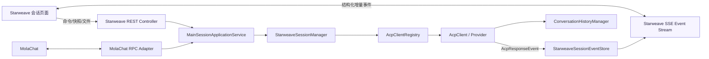

# Starweave 与 MolaChat 解耦的本地 ACP 会话设计

> 状态：编码完成并通过自动化回归（双实例、企微与真实 Provider 浏览器验收待运行环境）
>
> 适用范围：`cmd-proxy-app`、Starweave ConfigUI、普通 MAIN ACP 会话
>
> 环境本地身份：`starweave-{instanceId}`

## 0. 编码 TODO 与进度

> 维护规则：本清单是本次改造的唯一进度账本。开始编码前把任务标为 `🚧`，代码、测试和
> 文档同步完成后才标为 `✅`；发现阻塞标为 `⛔` 并记录原因。每次交付都更新“最近验证”。

状态：`⬜ 未开始` · `🚧 进行中` · `✅ 已完成` · `⛔ 阻塞`

### 0.1 基础身份与启动计划

- [x] `SW-000` ✅ 完成设计方案、隔离边界和验收定义。
- [x] `SW-101` ✅ 为 `AcpClientIdentity` 增加 `ClientSurface`、显式 owner 和 Starweave factory，保持旧 MAIN/TEAM factory 兼容。
- [x] `SW-102` ✅ 增加 `StarweaveIdentity`，由 `CmdProxyHome.instanceId()` 安全派生 `starweave-{instanceId}` 和 local groupId。
- [x] `SW-103` ✅ 拒绝 Starweave 保留 owner namespace 与 MolaChat chatterId 冲突，不把 Starweave owner 写入 chatterIds。
- [x] `SW-104` ✅ 引入 `AcpRuntimePlan`，允许无 chatterId 但存在可开启的 Starweave MAIN robot 时启动 ACP 核心服务。
- [x] `SW-105` ✅ history namespace 支持安全的 Starweave 分层目录，并保持 MolaChat 原目录兼容。

### 0.2 会话领域与应用服务

- [x] `SW-201` ✅ `MainSessionApplicationService` 已成为 MolaChat RPC 与 Starweave REST 共享的 MAIN create/send/cancel/status/history/replace/restore/idle-replace 边界。
- [x] `SW-202` ✅ registry 显式 identity、surface 保留、replacement 先启动后发布、启动失败保留旧 client 和并发单发布均已有测试。
- [x] `SW-203` ✅ 实现 `StarweaveSessionIndex`、desired 状态、generation、原子落盘和重启读取。
- [x] `SW-204` ✅ `StarweaveSessionManager.open/list/status/new/restore/cancel/delete` 已实现，并覆盖 generation、tombstone、Provider 启动失败补偿和共享生命周期替换。
- [x] `SW-205` ✅ 删除仅关闭当前运行会话并写 tombstone，保留 Provider 历史作为可恢复数据；下一次“开启会话”强制 `session/new`，不会误恢复已删除会话。
- [x] `SW-206` ✅ schedule/idle 替换按 surface 分发：MolaChat 保持 callback，Starweave 重装结构化 listener 并更新 generation/event；共享生命周期替换测试已覆盖。

### 0.3 结构化输出、历史与流式协议

- [x] `SW-301` ✅ 版本化 `StarweaveSessionEvent` 已贯通 groupId/sessionId/turnId/generation/eventSeq 和 terminal 边界，BUSY interrupt 的 pending turn 与旧 turn 分离。
- [x] `SW-302` ✅ 实现 `StarweaveAcpResponseListener`，输出结构化事件且不调用 MolaChat renderer/callback。
- [x] `SW-303` ✅ Starweave 自有 JSONL 日志按 turn 持久化，支持重启续号、10k 有界快照、16 MiB 原子压缩、前端卡片 reducer 和旧 `ContextMessage` 兼容投影。
- [x] `SW-304` ✅ 已实现有界 live ring、afterSeq、SSE、Last-Event-ID、heartbeat、浏览器自动重连及 `RESYNC_REQUIRED`。
- [x] `SW-305` ✅ live stream 强制校验当前 sessionId + generation，前端切换/恢复时关闭旧流、清空 reducer 并完整重绘。
- [x] `SW-306` ✅ 页面消息、企微信道入站、定时任务、TalkTo、子 Agent 和压缩事件统一进入结构化事件流，并标记来源与附件元数据。

### 0.4 HTTP、文件与安全

- [x] `SW-401` ✅ `/api/starweave/v1/sessions/*` REST envelope、明确错误码、有界 requestId 幂等和 admission 结果透传已实现，loopback HTTP/SSE 集成测试已覆盖。
- [x] `SW-402` ✅ 上传进入 Starweave 自有 staging，使用不透明 uploadId，绑定 group/session/generation，限制 20 MiB/文件和 10 文件/消息，成功接收后消费并按 TTL 清理。
- [x] `SW-403` ✅ 下载/预览仅接受服务端 resourceId，重新枚举 session/workspace 授权根并校验 real-path、符号链接、generation、预览及下载大小。
- [x] `SW-404` ✅ 会话 API 拒绝跨站浏览器请求，命令体限制 2 MiB、上传体限制 28 MiB，幂等指纹定长保存，SSE 使用独立 16 连接池并与普通 API 线程隔离。
- [x] `SW-405` ✅ ConfigUI 多环境 SSE 使用专用线程池逐块透传，普通 API 线程只负责校验和移交，不缓冲完整响应。

### 0.5 Starweave 页面

- [x] `SW-501` ✅ 智能体卡片增加“开启会话”图标，并置于“保存并应用智能体”之前。
- [x] `SW-502` ✅ 新增“会话”菜单、URL hash 导航、会话列表和 Starweave 双栏聊天布局。
- [x] `SW-503` ✅ READY/BUSY 状态控制发送、新建、恢复、取消、删除；失败恢复输入，terminal event 立即刷新状态，SSE 自动重连。
- [x] `SW-504` ✅ assistant delta 按 turn 聚合，安全 Markdown 渲染，工具调用按 toolCallId reducer 更新，并使用 Starweave 专属卡片样式。
- [x] `SW-505` ✅ 子 Agent、定时任务、TalkTo、上下文压缩和错误均使用独立图标、色条与可折叠详情卡片。
- [x] `SW-506` ✅ 支持附件选择与拖放、上传状态、发送前移除、消息附件、会话文件列表、安全预览和下载。
- [x] `SW-507` ✅ 桌面双栏、移动端会话抽屉、按真实视口固定聊天区、目录/内容独立滚动、overscroll 隔离和 EventSource 断线重连已实现。
- [x] `SW-508` ✅ 第一轮 UI 验收优化完成：输入区与表单风格统一，header 仅保留 icon 操作，恢复改为历史会话弹窗，开启/新建/恢复提供可见加载态，assistant 输出使用带安全包裹与内边距的 Markdown 气泡。
- [x] `SW-509` ✅ 第二轮 UI 验收优化完成：header icon 不再被原生 disabled 或 pointer-events 吞掉，不可用时返回明确原因；assistant 按工具边界切分流片段，工具调用卡按事件顺序穿插在调用前后文本之间，同一 toolCallId 的状态更新仍原位合并。
- [x] `SW-510` ✅ 第三轮 UI 验收优化完成：CLOSED 会话可从 header 的绿色播放按钮重新启动；流式输出仅在用户停留底部时自动跟随；附件展示上传中、就绪、失败及随消息发送反馈；会话 replacement 使用前端 transition generation 丢弃旧列表、历史和 SSE 响应，不再暴露瞬时 owner 错误。
- [x] `SW-511` ✅ 修复会话列表轮询放大的目录文件描述符泄漏：历史、附件、恢复、最近会话和预览扫描均显式关闭 `Files.list`，并增加连续扫描 `/proc/self/fd` 稳定性回归。
- [x] `SW-512` ✅ Starweave 团队来源与 MolaChat Fast Team 统一为生效普通 Robot 和 `onlyTeamMember` Robot，不再依赖 MAIN 会话；来源发现、严格校验、热重载注册及成员启动复用共享 Team 主链，团队选择框已使用专属对齐样式。
- [x] `SW-512` ✅ 第四轮 UI 与路由修复：附件入口始终可点击并对不可用状态给出反馈；接入用户区分 Starweave 系统 Chatter ID 与 MolaChat 用户 ID；MAIN 本地 TalkTo 按 surface + 精确 Chatter/owner + robot 隔离；连续工具调用之间不再渲染空 assistant 气泡。
- [x] `SW-513` ✅ 修复文件选择 change 回调过早清空 input 导致 FileList 丢失的问题，确保先复制文件快照再重置选择器；团队创建成员改用固定网格和自绘勾选框，使选择框、智能体名称及角色标签垂直对齐。
- [x] `SW-514` ✅ 按验收反馈移除团队成员的可见选择框，改为整张成员卡片通过主色背景、边框和文字反色表达选中状态，隐藏 checkbox 仅保留表单语义与键盘操作能力。
- [x] `SW-515` ✅ 修复企微信道绑定候选缓存不随生命周期更新：进入信道页、Starweave 会话与团队变更后立即刷新，并在信道页停留期间低频同步 MolaChat 外部 Team 状态；跨环境响应用请求序号和 instanceId 丢弃，已有选择保持不变并在失效时明确标记不可用。
- [x] `SW-516` ✅ 团队会话交互与普通会话对齐：成员事件改用同一套有界 SSE 即时推送与 requestAnimationFrame 帧合并，状态事件直接更新 READY/BUSY 投影且轮询仅作去重兜底；内部 Team prompt 在历史接口投影为结构化通讯卡片，不再展示 harness raw message；普通与团队会话均移除发送成功 toast。
- [x] `SW-517` ✅ 修复 Team TalkTo action/follow-up 完成后发送方残留 BUSY：成员 READY 不再依赖 listener `onComplete`，而是在 `AcpClient` 权威完成 `BUSY -> READY` 后发布；团队弹窗同时周期核对 clientState，事件投影偶发丢失时无需退出或刷新页面即可自愈。
- [x] `SW-518` ✅ Starweave 重启后自动恢复持久索引中所有 ACTIVE 会话，单个智能体恢复失败不阻断其他会话且仍以 CLOSED 留在页面；首屏同步全部导航数量，智能体编辑弹窗隔离背景滚动，并支持带平滑扩展动画的左侧导航折叠。

### 0.6 信道、能力隔离与远程扩展

- [x] `SW-601` ✅ 信道 binding targets 同时展示 MolaChat 和已开启的 Starweave MAIN 会话，并明确 surface 标签和精确 groupId。
- [x] `SW-602` ✅ 企微绑定 Starweave 后，入站用户消息与附件元数据、Agent 流式输出和工具卡片同步进入同一耐久事件流与会话页。
- [x] `SW-603` ✅ Starweave schedule owner 已增加 surface + exact logicalId 和独立持久目录，重启可恢复；旧 MolaChat schedule 路径保持兼容。
- [x] `SW-604` ✅ TalkTo 优先按发送方 surface 查找目标，Starweave 与 MolaChat 同名 robot 不串线，Starweave 远程 owner 使用环境唯一 ownerId。
- [x] `SW-605` ✅ 增加结构化 `AgentAddress(instanceId/surface/ownerId/robotId)` 并随 Starweave 会话/信道目标输出，为远程通讯录和 Team placement 保留稳定地址。
- [x] `SW-606` ✅ Starweave client 继续走统一 feature initializer；记忆、能力反思、MCP、权限、子 Agent、schedule、TalkTo 和自动新会话均以精确 group/identity owner 隔离。
- [x] `SW-607` ✅ 新增 Starweave 团队页面，可从已开启会话创建/删除本地 Fast Team、向成员发消息、取消、新建会话和触发记忆整理；Team 事件按 Starweave owner 投影到自有动态卡片，禁止回调 MolaChat。
- [x] `SW-608` ✅ Starweave Team 已接入 MolaChat 的可信 mixed-Team 协调器：本环境 Starweave 来源、明确共享给 `starweave-{instanceId}` 的本地 MolaChat 来源和跨环境来源可统一发现与选择；创建、删除、成员命令和结构化事件按稳定 instance/transport/team/member 身份路由，协调器离线时 mixed fragment 保持可见但操作 fail-closed，纯本地 Starweave Team 继续可用。

### 0.7 测试与发布门槛

- [x] `SW-701` ✅ identity、runtime plan、history namespace、generation、tombstone、结构化 listener、session manager、registry replacement、event store 并发和页面契约均已有测试。
- [ ] `SW-702` 🚧 REST/SSE、文件安全、慢消费者已覆盖；多环境 SSE 代理仍需双实例真实验收。
- [x] `SW-703` ✅ 现有 MolaChat RPC、callback、history、schedule、TalkTo、信道和 Fast Team 回归套件通过。
- [ ] `SW-704` ⬜ Starweave-only、MolaChat-only、同名 robot 共存和企微信道真实链路验收。
- [ ] `SW-705` ⬜ Codex/Claude/Kiro/OpenCode 工具卡片、连续卡片、文件、取消、恢复和删除实测。
- [x] `SW-706` ✅ Reactor test/package、前端语法、`git diff --check` 和最终变更审查已通过；构建产物已生成。

最近验证：

```text
2026-08-30 15:11：团队来源复用改造后执行干净 Reactor 全量测试，
`mvn -pl cmd-proxy-app -am clean test` 共 425 条测试，0 failures / 0 errors / 0 skipped；
新增回归覆盖普通 Robot、仅 Team Robot、无 MAIN 会话创建团队和伪造来源拒绝。
2026-08-30 15:13：`mvn -pl cmd-proxy-app -am -DskipTests package` 通过并重新生成普通 JAR
与 jar-with-dependencies；ConfigUI 内联 JavaScript 语法检查通过。

2026-08-30 14:42：针对 `Too many open files` 执行干净 Reactor 全量测试，
`mvn -pl cmd-proxy-app -am clean test` 共 419 条测试，0 failures / 0 errors / 0 skipped；
新增回归连续执行 200 轮会话目录扫描并校验 `/proc/self/fd` 未持续增长。
2026-08-30 14:44：`mvn -pl cmd-proxy-app -am -DskipTests package` 通过并生成普通 JAR
与 jar-with-dependencies；`git diff --check` 通过。

2026-08-30 13:56：Chrome/Playwright 实测 CLOSED 会话绿色播放按钮调用 open；80 条消息
构造滚动区后，上滑期间追加流增量保持原 scrollTop，手动回到底部后恢复自动跟随；模拟选择
hello.txt 后附件条从上传中更新为已就绪；页面无 JavaScript error。
2026-08-30 14:04：在允许 loopback HTTP 测试的环境执行最终
`mvn -pl cmd-proxy-app -am clean test`，从空 target 完成 Java/Kotlin 编译，cmd-proxy-app
共 418 条测试，0 failures / 0 errors / 0 skipped；新增测试确认 session-bound uploadId
最终以原文件名和内容进入 ACP send；Reactor BUILD SUCCESS。
2026-08-30 14:05：`mvn -pl cmd-proxy-app -am -DskipTests package` 通过并生成普通 JAR
与 jar-with-dependencies；ConfigUI JavaScript 语法、页面契约和 `git diff --check` 通过。

2026-08-30 13:16：第二轮 UI 验收优化后执行
`mvn -pl cmd-proxy-app -am clean test`，从空 target 开始完成 Java/Kotlin 编译，
cmd-proxy-app 共 417 条测试，0 failures / 0 errors / 0 skipped；Reactor BUILD SUCCESS。
2026-08-30 13:17：`mvn -pl cmd-proxy-app -am -DskipTests package` 通过并重新生成
普通 JAR 与 jar-with-dependencies；ConfigUI JavaScript 语法和 `git diff --check` 通过。
2026-08-30 13:15：Chrome/Playwright 实测 header 5 个 icon、0 个原生 disabled；无历史、
无可取消任务、STARTING 无法新建、BUSY 无法删除和操作进行中重复点击均有明确提示。
同一 turn 的真实 DOM 顺序为 assistant → tool → assistant；同一工具的 running/completed
更新合并为一张卡，最终状态为 completed。

2026-08-30 09:53：第一轮 UI 验收优化后执行
`mvn -pl cmd-proxy-app -am clean test`，从空 target 开始完成 Java/Kotlin 编译，
cmd-proxy-app 共 417 条测试，0 failures / 0 errors / 0 skipped；Reactor BUILD SUCCESS。
2026-08-30 09:54：`mvn -pl cmd-proxy-app -am -DskipTests package` 通过，普通 JAR
（1,080,454 bytes）与 jar-with-dependencies（49,973,219 bytes）均已生成；ConfigUI
内联 JavaScript 通过 Node `new Function(...)`，`git diff --check` 通过。
2026-08-30 09:51：使用 Chrome/Playwright 以真实 DOM 渲染会话页和恢复弹窗：900px
视口下 body clientHeight/scrollHeight 均为 900px，聊天区完整落在视口内；输入框高度
68px、圆角 9px、禁止外部 resize 且内部 overflow auto；header 无 select；Markdown
标题和代码块均生成；恢复弹窗正确列出 2 条模拟历史会话。

2026-08-30 09:18：用户从干净环境构建发现 `ConfigUiServer` 残留未使用的 Kotlin
`AcpProxy` import。09:12/09:13 的结果复用了旧 target/classes，只能视为增量回归，
不作为最终发布证据。该 import 已移除，并于 09:22 首次通过 clean Reactor 417 条测试；
本轮 09:53 再次以 clean test 复验通过。

2026-08-30 09:10：接手 08:46 后的未编译工作树并修复共享会话服务签名；
`StarweaveSessionManagerTest`、`AcpClientRegistryReplacementTest`、
`StarweaveSessionEventStoreTest`、`StarweaveSessionHttpTest`、
`StarweaveCommandEnvelopeTest`、`ConfigUiLayoutContractTest` 共 26 条测试通过，
覆盖 replacement 启动失败补偿、并发单发布、open/new/restore/delete/reopen、共享
schedule 生命周期投影、事件并发/重启续号/慢消费者、同源限制、SSE generation 门控和
HTTP admission 结果透传；Maven BUILD SUCCESS。ConfigUI 内联 JavaScript 再次通过
Node `new Function(...)` 语法检查。

2026-08-30 01:38：`AcpClientIdentityTest`、`StarweaveIdentityTest`、
`AcpRuntimePlanTest`、`ConversationHistoryManagerTest`、`StarweaveSessionIndexTest`、
`StarweaveAcpResponseListenerTest`、`StarweaveRequestDeduplicatorTest`、
`ScheduleOwnerIsolationTest`、`ConfigUiLayoutContractTest` 共 50 条测试通过，覆盖
Starweave 精确 schedule owner 的落盘/重启恢复、REST requestId 幂等和页面会话契约；
Maven BUILD SUCCESS。ConfigUI 内联 JavaScript 已通过 Node `new Function(...)` 语法检查。

2026-08-30 01:41：`mvn -pl cmd-proxy-app -am test` 在允许 loopback socket 的环境中
通过，cmd-proxy-app 共 398 条测试，0 failures / 0 errors；Reactor BUILD SUCCESS。
2026-08-30 01:42：`mvn -pl cmd-proxy-app -am -DskipTests package` 通过，普通 JAR 与
jar-with-dependencies 均已生成；`git diff --check` 通过。
```

## 1. 结论

Starweave 应成为普通 ACP 会话的第二个独立交互面，而不是通过浏览器模拟 MolaChat RPC。

本方案保留用户指定的会话标识规则：

```text
STARWEAVE_OWNER_PREFIX = "starweave-"
starweaveChatterId = STARWEAVE_OWNER_PREFIX + CmdProxyHome.instanceId()
acpId = "acp-" + normalize(robotName)
groupId = sort(starweaveChatterId, acpId).join("")
```

例如当前环境 `instanceId=hostA-home-mola-cmd-proxy`，则 Starweave owner 为
`starweave-hostA-home-mola-cmd-proxy`。

该 owner 是服务端根据当前环境稳定 `instanceId` 派生的保留身份，不由前端填写，不写入
`acpConfig.json.chatterIds`，也不进入 MolaChat 的发现、RPC 路由和回调链路。这样既保持
Starweave 与 MolaChat 解耦，又能为远程通讯录和跨环境 Team 提供全局可区分的来源身份。
Starweave 与 MolaChat 只共享 ACP 领域服务、Provider、能力初始化和持久化组件，不共享
页面、展示 HTML 或传输协议。

核心决策如下：

| 维度 | MolaChat | Starweave |
|---|---|---|
| 会话 owner | 配置的 `chatterId` | 环境派生的 `starweave-{instanceId}` |
| 会话运行时 | `AcpClientRegistry` 中的 MAIN client | 同一 registry 中带 `STARWEAVE` surface 的 MAIN client |
| 外部入口 | cmd-proxy RPC command/callback | ConfigUI REST + SSE |
| 输出格式 | 现有 Markdown/HTML 卡片 | 结构化事件，由 Starweave 自己绘制 |
| 历史展示 | MolaChat 自己的消息投影 | cmd-proxy 本地结构化 UI 事件日志 |
| MolaChat 同步 | `acpSyncRobots` 可见 | 永不进入同步 |
| RPC group 注册 | 注册 | 不注册 |
| 会话切换通知 | `acpSessionChanged` callback | 本地 `SESSION_REPLACED` SSE 事件 |
| 页面关闭后能力 | 由 MolaChat 与 cmd-proxy 共同承载 | 运行时继续存在，定时任务和信道不依赖页面在线 |

## 2. 背景与当前问题

当前普通 MAIN ACP 的创建以 `chatterId × robot` 的笛卡尔积为基础：一个 `groupId` 对应一个当前 `AcpClient`。ConfigUI 的消息渠道下拉框也直接保存这个 `groupId`，因此目前“选择智能体”实际上是在选择某个 MolaChat 用户的会话槽位。

这导致以下耦合：

1. `chatterIds` 为空时，`Main.kt` 只启动 ConfigUI，不启动 ACP 服务。
2. ConfigUI 没有自己的会话入口、消息流和历史投影。
3. 消息渠道无法绑定纯本地智能体，只能绑定 `chatterId + robot` client。
4. 默认 `AcpResponseListener` 会把输出渲染成 MolaChat 所需的内容，再通过 RPC callback 推送。
5. 会话创建、恢复、状态、历史等能力目前埋在 `AcpProxy.registerGroupCommands()` 的 RPC handler 中，ConfigUI 无法作为本地应用层直接复用。
6. 定时任务 MAIN owner 目前主要由 `robotName` 标识；当同名机器人同时存在于 MolaChat 和 Starweave 时，不能可靠定位目标 client。

因此，仅仅把派生出的 `starweave-{instanceId}` 塞进 `chatterIds` 并不能实现解耦。那样会污染 MolaChat robot 同步、实例冲突检查、RPC group 和会话回调，还会让没有 MolaChat 的部署继续依赖 MolaChat 身份模型。

## 3. 目标与非目标

### 3.1 目标

1. 不配置任何 MolaChat `chatterId` 时，仍可在 Starweave 中配置、开启并使用普通 ACP 智能体。
2. 智能体列表增加“开启会话”图标，位于“保存并应用智能体”之前。
3. 新增“会话”菜单，支持会话创建、选择、恢复、取消当前 turn、新建 session 和删除。
4. 会话右侧聊天区支持文本流、文件、工具调用、子 Agent、定时任务、TalkTo、上下文压缩和错误等事件。
5. 会话历史按真实 `sessionId` 隔离。恢复后必须清空旧视图，并按目标 session 快照重新渲染。
6. 复用普通 MAIN ACP 的完整能力初始化链路，包括记忆、能力反思、MCP、工具权限、子 Agent、定时任务、TalkTo、自动新会话和消息渠道。
7. MolaChat 现有协议和 UI 行为保持兼容。
8. Starweave 使用自己的结构化事件和视觉组件，不复用 MolaChat 卡片 HTML。

### 3.2 非目标

1. 不在浏览器中实现 ACP 协议；ACP 协议仍由服务端 `AcpClient` 处理。
2. 不让浏览器直接访问本地文件路径或 Provider session 文件。
3. 不把单条历史消息编辑或删除解释为改写 Provider 上下文。Provider 没有统一的历史重写能力。
4. 第一阶段不重写 Fast Team 领域模型；但 Starweave 的能力契约必须预留 Team 入口，最终达到 MolaChat 已支持能力的对等覆盖。
5. 不以伪造 MolaChat 用户、发送 MolaChat callback 或依赖 MolaChat 在线作为实现手段。

## 4. 术语和身份模型

### 4.1 Robot、逻辑会话槽位与 Provider session

必须区分三层：

| 对象 | 含义 | 生命周期 |
|---|---|---|
| Robot 配置 | Provider、工作目录、MCP、记忆、协作关系等模板 | 配置文件级 |
| 逻辑会话槽位 | Starweave 对某个 robot 的当前 MAIN client，键为 `groupId` | 可跨 Provider session 替换 |
| Provider session | ACP `session/new` 或 `session/load` 返回的真实 `sessionId` | 一段具体对话历史 |

“开启会话”首先确保逻辑会话槽位存在；“新建会话”和“恢复会话”会替换该槽位中的当前 `AcpClient`。

### 4.2 扩展 `AcpClientIdentity`

保持 `Scope.MAIN`，新增正交的交互面字段，避免破坏现有 MAIN 能力判断：

```java
enum ClientSurface {
    MOLACHAT,
    STARWEAVE,
    CHANNEL,
    TEAM
}
```

Starweave identity 建议为：

```text
scope             = MAIN
surface           = STARWEAVE
logicalId         = groupId(starweave-{instanceId}, acpId)
ownerId           = starweave-{instanceId}
transportGroup    = starweave-local:{instanceId}:{safeRobotKey}
historyNamespace  = starweave/{safeRobotKey}
sourceRobotName   = robot.name
```

约束：

- `logicalId` 继续满足指定的 `chatterId + robotId` 规则。
- 新代码不得再从拼接后的 `groupId` 反向截取 `chatterId`；必须读取显式 identity。
- `transportGroup` 只是稳定的本地能力身份，不注册为 MolaChat RPC group。
- `historyNamespace` 与 MolaChat 普通会话隔离，避免两个交互面共享 `last_session`、文件或 turn 历史。
- `starweave-` 是系统 owner namespace。配置校验应拒绝用户把任何以该前缀开头的值加入 MolaChat `chatterIds`。
- 多个 `CMD_PROXY_HOME` 由各自的 instance home 隔离；本地 logical ID 相同不会形成跨实例 RPC 冲突。

### 4.3 环境身份和远程地址

`CmdProxyHome.instanceId()` 首次生成后持久化在当前 `CMD_PROXY_HOME/instance-id`，并限制为
`[a-zA-Z0-9._-]+`。因此 `starweave-{instanceId}`：

- 在同一环境重启后保持不变；
- 在不同环境、不同数据根或显式不同 instanceId 之间可区分；
- 不包含冒号，可兼容现有 `{chatterId}:{robotName}` 展示格式；
- 可直接作为 discovery、远程通讯录和 Team placement 的 owner identity。

远程协议不能长期依赖拼接字符串。新增统一地址模型：

```json
{
  "schemaVersion": 1,
  "instanceId": "hostA-home-mola-cmd-proxy",
  "surface": "STARWEAVE",
  "ownerId": "starweave-hostA-home-mola-cmd-proxy",
  "robotId": "acp-Code_Agent"
}
```

路由时必须同时校验 `instanceId + surface + ownerId + robotId`，不能只凭 robotName 或
`starweave-` 文本前缀猜目标。`starweave-{instanceId}:robotName` 只作为当前 TalkTo
兼容展示，不作为持久化权威键。

如果管理员显式修改 instanceId 或删除 `instance-id` 后重新生成，系统应视为新环境身份：
旧的远程通讯录地址和 Team placement 不得静默指向新实例。需要通过显式迁移/重新发现
更新引用，并保留旧 owner tombstone 供诊断。

## 5. 总体架构



关键原则：

1. `MainSessionApplicationService` 是会话命令的唯一应用层入口。
2. MolaChat RPC handler 与 Starweave REST handler 都是薄适配器。
3. ACP 输出先保持结构化语义，再分别交给 MolaChat renderer 或 Starweave event listener。
4. `AcpClientRegistry` 和会话管理器是运行时权威；浏览器只保存选中项和流式投影。
5. 任何慢速浏览器连接都不能阻塞 ACP turn、会话替换、取消、删除或服务停机。

## 6. 服务启动与运行计划

### 6.1 运行目标拆分

启动时先构造 `AcpRuntimePlan`：

```text
molachatTargets   = chatterIds × ordinaryRobots
starweaveTargets  = 持久化为 desired=ACTIVE 的 Starweave 会话槽位
channelTargets    = 启用信道明确引用的 Starweave/MolaChat/Team target
teamSources       = 当前 Fast Team 来源集合
```

启动门控从“`robots` 和 `chatterIds` 都非空”改为：

```text
存在 enabled robot，并且以下任一条件成立：
- 有 MolaChat target；
- 有 Starweave desired target；
- 有启用信道需要本地 target；
- 有需恢复执行的本地定时任务 owner；
- 有需恢复的 Team runtime。
```

ConfigUI 始终启动。没有任何运行 target 时，系统保持“可配置但未开启会话”状态。

### 6.2 Starweave 会话的 desired 状态

`StarweaveSessionIndex` 持久化每个 robot 是否需要在进程重启后恢复：

```json
{
  "schemaVersion": 1,
  "entries": [
    {
      "robotName": "Code Agent",
      "groupId": "acp-Code_Agentstarweave-hostA-home-mola-cmd-proxy",
      "desired": "ACTIVE",
      "currentSessionId": "provider-session-id",
      "generation": 4,
      "updatedAt": 1788021600000
    }
  ]
}
```

- 第一次“开启会话”：写入 `desired=ACTIVE`，强制 `session/new`。
- 已有记录但进程未运行：尝试 `session/load(currentSessionId)`；不支持 load 时创建新 session，并明确提示“Provider 不支持恢复”。
- 已有且 client 正在运行：只选中，不重复创建。
- 删除当前会话：移除 ACTIVE 指针并写删除 tombstone；下一次“开启会话”必须强制 `session/new`。
- 浏览器关闭不改变 desired 状态，保证定时任务和消息渠道继续工作。

## 7. 后端领域组件

### 7.1 `MainSessionApplicationService`

从 `AcpProxy.registerGroupCommands()` 中抽取可复用方法：

```text
openStarweaveSession(robotName, requestId)
listSessions(query)
getSessionSnapshot(groupId, sessionId, expectedGeneration)
sendMessage(groupId, expectedSessionId, expectedGeneration, message, uploadIds, busyPolicy)
cancelPrompt(groupId, expectedSessionId, expectedGeneration)
createNewSession(groupId, expectedSessionId, expectedGeneration)
restoreSession(groupId, targetSessionId, expectedGeneration)
deleteSession(groupId, sessionId, expectedGeneration)
getStatus(groupId)
getContextUsage(groupId)
```

MolaChat 现有 `acpSendMessage`、`acpCancelPrompt`、`acpNewSession`、`acpListSessions`、`acpRestoreSession` 等 handler 改为调用该 service，并继续组装旧 `resultMap`，保持协议兼容。

### 7.2 `StarweaveSessionManager`

职责：

- 根据 robot 配置生成服务端可信 identity；
- 管理 Starweave desired index、generation 和删除 tombstone；
- 调用 registry 创建、替换、恢复和关闭 client；
- 使用与普通 MAIN 相同的 `AcpClientFeatureInitializer`；
- 给 client 安装 `StarweaveAcpResponseListener`；
- 发布状态变化和 session replacement 事件；
- robot 保存并应用时，按当前 session 恢复能力重建 client；
- 服务停止时落盘历史，不把本地状态回调给 MolaChat。

不得把浏览器连接、SSE response 或 HTTP exchange 保存在 manager 中。

### 7.3 统一会话生命周期事件

把当前 `notifyMainSessionChanged()` 改为内部事件：

```java
SessionLifecycleEvent {
    surface,
    instanceId,
    groupId,
    oldSessionId,
    newSessionId,
    generation,
    reason,
    timestamp
}
```

订阅者：

- `surface=MOLACHAT`：现有 `acpSessionChanged` callback adapter；
- `surface=STARWEAVE`：本地 event store + SSE；
- 调度、信道等内部组件：按 identity 精确更新引用。

这样可以避免自动轮转、定时任务轮转或手动恢复无条件通知 MolaChat。

## 8. 页面交互设计

### 8.1 导航

左侧菜单调整为：

```text
系统设置
消息渠道
智能体
会话        ← 新增
工具权限
```

会话菜单图标建议使用 `forum`，右侧 count 展示当前环境未删除的 session 数量。

### 8.2 智能体卡片

操作顺序：

```text
[开启会话] [保存并应用智能体] [编辑] [删除]
```

“开启会话”使用 `chat` 或 `forum` icon，位于当前 refresh icon 之前。

按钮规则：

- robot `enabled=false`：禁用，提示“请先启用并保存智能体”。
- `onlySubAgent=true` 或 `onlyTeamMember=true`：禁用，因为不能创建普通 MAIN 会话。
- 页面存在未保存修改：不静默使用旧配置；弹出“保存并应用后开启 / 取消”。
- 点击后立即跳到“会话”菜单并显示骨架屏；后端返回已有会话时选中它，返回创建任务时展示 `STARTING`。
- 使用 URL hash 保存可恢复导航，例如：

```text
#sessions?groupId={urlEncodedGroupId}&sessionId={urlEncodedSessionId}
```

不得只依赖全局 JavaScript 变量，否则刷新页面后会丢失选择。

### 8.3 会话页面布局

桌面端：

```text
┌──────────────────────────────────────────────────────────────────┐
│ 会话                                             [新建会话] [···] │
├───────────────────┬──────────────────────────────────────────────┤
│ 搜索会话          │ Robot 名称  READY       上下文 36%  [取消]   │
│                   ├──────────────────────────────────────────────┤
│ ● Code Agent      │                                              │
│   当前 · 2分钟前  │ 用户消息                                     │
│                   │                                              │
│ ○ Code Agent      │ Agent 流式消息                               │
│   历史 · 昨天     │ ┌─ 工具调用卡片：exec_command ────────────┐ │
│                   │ │ 状态、输入、输出、耗时                    │ │
│ ○ Review Agent    │ └──────────────────────────────────────────┘ │
│   历史 · 3天前    │                                              │
│                   ├──────────────────────────────────────────────┤
│                   │ [附件] 输入消息……                 [发送]    │
└───────────────────┴──────────────────────────────────────────────┘
```

移动端：会话列表折叠为抽屉，聊天区保持单列；输入框固定在聊天区域底部，而不是整个页面 viewport 底部。

左侧列表项显示：

- robot 名称与 Provider；
- session 摘要、更新时间；
- 当前/历史标记；
- 当前 client 状态；
- 错误或“Provider 不支持恢复”提示；
- 删除入口放在 `···` 菜单，避免误触。

右侧顶部操作：

- 新建会话；
- 恢复当前选中的历史 session；
- 取消当前 turn；
- 删除 session；
- 上下文占用；
- Provider、workspace 和 sessionId 的只读信息。

### 8.4 选择与恢复

选择历史 session 只加载其本地快照，不立即替换运行中的 client，避免用户浏览历史时意外中断当前工作。

历史 session 的输入框只读，显示“恢复后继续对话”。用户点击“恢复”后：

1. 后端校验当前 client 为 READY、目标 session 存在且 generation 未变化；
2. 当前 client 关闭，使用 `session/load` 创建 replacement；
3. generation 增加，发布 `SESSION_REPLACED`；
4. 前端立即清空右侧旧 DOM 和本地 reducer；
5. 重新获取目标 session snapshot；
6. 从 snapshot 的 `lastEventSeq` 继续订阅增量事件；
7. 新 client READY 后开放输入。

不得把目标历史快照追加到原会话 DOM 中。

## 9. 状态与页面操作控制

复用 `AbstractAcpClient.State`：`CREATED / STARTING / READY / BUSY / ERROR / CLOSING / CLOSED`，另由页面投影补充 `NO_SESSION / DELETED / RESTORING`。

| 状态 | 发送 | 附件 | 新建 | 恢复 | 取消 turn | 删除 | 重试启动 |
|---|---:|---:|---:|---:|---:|---:|---:|
| NO_SESSION | 否 | 否 | 是 | 有历史时是 | 否 | 否 | 开启会话 |
| CREATED | 否 | 否 | 否 | 否 | 否 | 是 | 否 |
| STARTING | 否 | 可暂存 | 否 | 否 | 否 | 是 | 否 |
| READY | 是 | 是 | 是 | 是 | 否 | 是 | 否 |
| BUSY | 否 | 可暂存 | 否 | 否 | 是 | 需先确认取消 | 否 |
| ERROR | 否 | 否 | 否 | 否 | 否 | 是 | 是 |
| CLOSING | 否 | 否 | 否 | 否 | 否 | 否 | 否 |
| CLOSED | 否 | 否 | 否 | 否 | 否 | 是 | 是 |
| RESTORING | 否 | 否 | 否 | 否 | 否 | 否 | 否 |
| DELETED | 否 | 否 | 否 | 否 | 否 | 否 | 重新开启 |

默认 BUSY 时发送按钮禁用，用户使用“取消”结束当前 turn。后续若开放中断发送，必须显式选择 `busyPolicy=INTERRUPT`，并保持现有 `SENT / INTERRUPTED_PENDING / CANCEL_FAILED / REJECTED_STATE` 契约。

所有状态按钮既要在前端禁用，也必须由服务端再次校验；前端状态不构成授权或并发保证。

## 10. Starweave HTTP API

统一前缀：`/api/starweave/v1`。所有响应使用版本化 envelope：

```json
{
  "schemaVersion": 1,
  "requestId": "uuid",
  "accepted": true,
  "code": "ACCEPTED",
  "message": "",
  "data": {}
}
```

建议接口：

| 方法 | 路径 | 作用 |
|---|---|---|
| GET | `/sessions` | 查询当前环境所有有效/历史 session |
| POST | `/sessions/open` | 按 robot ensure 当前 Starweave 会话 |
| GET | `/sessions/{groupId}/{sessionId}/snapshot` | 获取目标 session 的完整展示快照 |
| POST | `/sessions/{groupId}/messages` | 发送文本和已上传文件 |
| POST | `/sessions/{groupId}/cancel` | 取消当前 turn |
| POST | `/sessions/{groupId}/new` | 创建新 Provider session |
| POST | `/sessions/{groupId}/restore` | 恢复指定 Provider session |
| DELETE | `/sessions/{groupId}/{sessionId}` | 删除当前或历史 session |
| GET | `/sessions/{groupId}/status` | 状态、sessionId、generation、上下文占用 |
| GET | `/sessions/events` | SSE 增量事件，支持 group/session 过滤 |
| POST | `/uploads` | 上传临时文件，返回不可猜测 uploadId |
| DELETE | `/uploads/{uploadId}` | 删除未发送的临时文件 |
| GET | `/session-files/{resourceId}` | 下载/预览会话文件 |

有状态命令必须携带：

```json
{
  "requestId": "客户端生成的 UUID",
  "expectedSessionId": "当前页面看到的 sessionId",
  "expectedGeneration": 4
}
```

服务端错误码至少包括：

```text
ROBOT_NOT_FOUND
ROBOT_DISABLED
ROBOT_NOT_MAIN_CAPABLE
SESSION_NOT_FOUND
SESSION_STALE
STATE_NOT_READY
ALREADY_BUSY
CANCEL_FAILED
PROVIDER_RESTORE_UNSUPPORTED
UPLOAD_NOT_FOUND
FILE_TOO_LARGE
PATH_OUTSIDE_WORKSPACE
EVENT_REPLAY_REQUIRED
INTERNAL_ERROR
```

`requestId` 作为短期幂等键，防止浏览器超时重试造成重复 `session/new` 或重复发消息。

## 11. 流式事件协议

### 11.1 为什么使用 SSE

会话输出主要是服务端单向流，命令继续使用 REST。SSE 天然支持浏览器自动重连、`Last-Event-ID` 和代理可观测性，比在当前轻量 ConfigUI 内新增 WebSocket 协议更小。

SSE envelope：

```json
{
  "schemaVersion": 1,
  "instanceId": "...",
  "groupId": "...",
  "sessionId": "...",
  "generation": 4,
  "turnId": "...",
  "eventSeq": 128,
  "timestamp": 1788021600000,
  "type": "TOOL_CALL_UPDATED",
  "payload": {}
}
```

事件类型：

```text
SESSION_STATE_CHANGED
SESSION_REPLACED
SESSION_DELETED
USER_MESSAGE_ACCEPTED
ASSISTANT_MESSAGE_DELTA
TOOL_CALL_STARTED
TOOL_CALL_UPDATED
TOOL_CALL_COMPLETED
SUB_AGENT_EVENT
SCHEDULE_EVENT
TALK_TO_EVENT
COMPACTION_COMPLETED
FILE_ATTACHED
TURN_COMPLETED
TURN_CANCELLED
TURN_ERROR
RESYNC_REQUIRED
```

工具调用事件保留 `toolCallId`、title、status、kind、rawInput、rawOutput 和可选资源引用。前端按 `toolCallId` 更新同一张卡片，而不是每个 update 新建卡片。

### 11.2 顺序与恢复

- `eventSeq` 在一个逻辑 `groupId` 内严格单调递增。
- `generation` 每次 client replacement 增加。
- 前端只接收与当前选中 `sessionId + generation` 一致的事件。
- snapshot 返回 `lastEventSeq`；SSE 使用 `after=lastEventSeq` 补齐间隙。
- 服务端保留有界内存 ring buffer，并以事件日志作为较长时间的重放来源。
- 无法补齐时发送 `RESYNC_REQUIRED`，前端重新获取 snapshot。
- 每 15 秒发送 heartbeat；heartbeat 不写历史。
- 浏览器消费慢或连接断开不能反压 ACP client。每个订阅者使用有界队列，溢出后断开并要求 resync。

当前 `ConfigUiServer` 使用固定 4 线程，不能让长期 SSE 连接长期占满普通 API 线程。SSE response 的写入应移交给独立、有上限的 stream executor，并限制每实例和每 session 的连接数。

## 12. 输出监听与 Starweave 卡片

### 12.1 不复用 MolaChat renderer

当前 `AcpResponseContentRenderer` 会生成 MolaChat 使用的 Markdown/HTML `<details>`。Starweave 不应解析这些字符串。

新增：

```text
StructuredAcpResponseEvent          领域事件
StarweaveAcpResponseListener        写事件日志并发布 SSE
MolaChatAcpResponseListener         继续交给现有 renderer/callback
```

`AcpClient` 内部仍通过 `AcpResponseListener` 发出文本、工具、子 Agent、定时任务、TalkTo、压缩和终止边界。Starweave listener 将其映射成结构化事件，不包含展示 HTML。

### 12.2 Starweave 绘制规范

- 沿用现有 `--sw-primary`、卡片圆角、细边框和浅紫色强调。
- Agent 文本使用安全 Markdown renderer；默认禁用原始 HTML。
- 工具卡片默认折叠，显示工具名、状态、耗时；输入与输出分区展开。
- `pending / in_progress / completed / cancelled / error` 使用一致的状态色和图标。
- 子 Agent 卡片按 agentName 聚合进度和最终结果。
- 定时任务、TalkTo、上下文压缩使用专属业务卡片，不降级成通用工具卡片。
- 同一 turn 中连续卡片与卡片后的文本必须按 `eventSeq` 保持顺序。
- 超大工具输出不直接塞进 DOM；显示截断预览和受限资源查看入口。
- 所有来自 Agent 的 title、Markdown、JSON 和文件名都按不可信内容处理，禁止拼接到 `innerHTML`；必须转义或经白名单 sanitizer。

## 13. 历史消息存储与恢复渲染

### 13.1 双层存储

继续使用 `ConversationHistoryManager` 保存 Provider 上下文：USER、ASSISTANT、TOOL、turn 和附件。

新增 `StarweaveSessionEventStore` 保存 UI 所需的结构化展示事件，因为现有 `ContextMessage` 无法完整保存子 Agent 进度、定时任务卡片、压缩事件和工具更新的页面状态。

建议目录：

```text
${CMD_PROXY_HOME}/session/starweave/{safeRobotKey}/
├── index.json
├── last_session
├── {sessionId}/
│   ├── meta.json
│   ├── turn_0000.json
│   ├── turn_0001.json
│   ├── files/
│   └── ui-events.jsonl
└── .trash/
    └── {deletionId}/...
```

需要扩展 history namespace 的安全解析，使非 Team MAIN identity 也能使用经过逐段校验的分层相对路径；禁止简单接受任意字符串路径。

### 13.2 落盘规则

- 用户消息被服务端接收后立即记录 `USER_MESSAGE_ACCEPTED`。
- 文本 delta 实时发送；event store 可按大小合并，turn 终止时持久化最终 assistant block，避免大量小文件。
- 工具事件按 `toolCallId` 保存最终 reducer 状态，同时保留必要的顺序信息。
- 每个 turn 在 `TURN_COMPLETED / CANCELLED / ERROR` 后执行原子 flush。
- snapshot 由服务端 reducer 从事件日志构建，不让浏览器解析本地 turn 文件。
- 旧历史没有 `ui-events.jsonl` 时，使用 `ContextMessage` 生成兼容快照；无法恢复的进度型卡片只展示最终状态，不伪造过程。
- 工具输入输出设置单事件大小上限；超出部分落为受控 resource，并在事件中保存 resourceId。

### 13.3 恢复后的重新渲染

恢复成功是一个 generation 边界。页面收到 `SESSION_REPLACED` 后必须：

1. 停止当前消息 reducer；
2. 清空当前 session 的消息 DOM、pending tool map 和流式文本 buffer；
3. 使用新 `sessionId + generation` 获取 snapshot；
4. 完整渲染 snapshot；
5. 从 snapshot seq 继续接收 SSE。

禁止复用当前 `replaySessionSnapshot()` 向 MolaChat listener 推一串展示字符串的方式；该函数应逐步下沉为结构化 snapshot service，MolaChat adapter 可继续把 snapshot 转换为旧 callback。

## 14. 文件能力与安全边界

### 14.1 上传

浏览器先上传到服务端 staging：

```text
${CMD_PROXY_HOME}/uploads/starweave/{randomUploadId}/file
```

服务端返回 `uploadId`、原始文件名、媒体类型、大小和摘要。发送消息时只提交 `uploadId`，服务端校验：

- upload 属于当前 instance 和当前浏览器/本地 principal；
- 未过期且未被消费；
- 数量、单文件大小和总大小未超限；
- 文件是普通文件，真实路径位于 staging 根目录；
- 文件名经过清洗，不能路径穿越。

验证后由服务端转换成受限文件内容并走共享 `AcpClient.send(...)` 链路，写入目标 session
的服务端文件目录，再把授权后的绝对路径加入 ACP prompt。不得让浏览器提交任意本地路径或 URL。

### 14.2 查看与下载

- 消息和工具事件只返回服务端生成的 `resourceId`。
- 读取时携带 `instanceId / groupId / expectedSessionId / generation / resourceId`。
- 获取不可变 read context 后释放会话锁，再做 I/O；读取前后校验 generation。
- workspace 文件只允许真实路径位于 workspace 根目录，拒绝 symlink/reparse 逃逸、目录、设备和特殊文件。
- 文本预览限制字节数、行数、解码时间和并发；二进制文件只允许下载或使用专用预览。
- 响应设置安全的 `Content-Disposition`、`X-Content-Type-Options: nosniff` 和 CSP。

### 14.3 基本消息操作

第一版支持：发送、取消当前 turn、复制消息、复制代码块、重试失败的用户输入、下载附件和查看安全文本预览。

“重试”是重新发送一条新 turn，不重写 Provider 历史。单条已完成历史消息不提供删除/编辑，以免 Starweave 展示历史与 Provider 实际上下文不一致。

## 15. 会话删除语义

Provider 没有统一的 `session/delete`，因此删除定义为 Starweave 本地逻辑删除：

### 15.1 删除历史 session

1. 校验它不是当前 BUSY session；
2. 从有效 session index 移除；
3. 将本地历史和 UI event 目录原子移动到 `.trash/{deletionId}`；
4. 写 tombstone，防止自动恢复；
5. 默认保留 7 天后由有界后台清理任务清除。

### 15.2 删除当前 session

1. READY 时直接关闭；BUSY 时要求用户确认，先执行协议级 `session/cancel`；
2. client 进入 CLOSING，拒绝新消息；
3. flush 当前 turn、文件、记忆 pending 和 UI events；
4. 从 registry 移除 client；
5. Starweave index 移除 ACTIVE 指针，并写 `forceNewOnNextOpen=true` tombstone；
6. 暂停依赖该 Starweave owner 的定时任务执行，但不静默删除任务；
7. 发布 `SESSION_DELETED`。

再次点击“开启会话”时忽略其他历史 session 和 `last_session`，强制 `session/new`；创建成功后清除 tombstone。

删除 robot 配置与删除 session 是不同操作。删除 robot 前必须展示关联的 Starweave sessions、消息渠道、定时任务和 Team 来源，并由用户确认处理方式。

## 16. 完整能力对等

Starweave local MAIN client 必须走与 MolaChat MAIN 相同的 feature initializer，但 owner 和 presentation 必须按 surface 隔离。

| 能力 | 复用点 | Starweave 适配要求 |
|---|---|---|
| Provider / MCP | `AcpClient`、AgentProvider | 完全复用，状态和错误结构化返回 |
| 工具权限 | `McpAuthManager` | 使用环境本地 principal `starweave-{instanceId}`，不能借用某个 MolaChat 用户 |
| 文件 | `sendLocalFiles`、history manager | 增加安全 upload/resource API |
| 记忆 | `initMemoryForClient` | manager key 使用 Starweave source group，历史 namespace 隔离 |
| 能力反思 | `initAbilityReflection` | 复用 robot/workspace；事件进入 Starweave 卡片 |
| 子 Agent | `initSubAgentDispatcher` | 复用允许列表；结构化子 Agent 事件 |
| 定时任务 | `ScheduleTaskManager` | owner 必须包含 surface + logical client，不再只靠 robotName |
| TalkTo | `TalkToDispatcher` | Starweave 本地 robot 路由不得误选 MolaChat 的同名 client |
| 上下文压缩 | `AcpClient` compaction event | 使用 Starweave 专属压缩卡片，并保持 harness 重注入 |
| 自动新会话 | `startAutoNewSession` | 发布本地 lifecycle event，不调用 MolaChat callback |
| 消息渠道 | `ChannelBindingResolver` | 可选择 Starweave local MAIN target；无需 chatterIds |
| 历史恢复 | registry replace/load | generation 边界 + snapshot 重绘 |
| Fast Team | `TeamManager` | 后续提供 Starweave Team 页面和结构化 Team 事件，协议不依赖 MolaChat UI |

### 16.1 定时任务 owner 改造

当前 `ScheduleOwnerKey.main(robotName)` 会让 MolaChat 和 Starweave 同名 robot 共享 owner。应扩展为：

```text
ScheduleOwnerKey.main(surface, ownerLogicalId, robotName)

MolaChat:   schedules/main/molachat/{safeOwnerId}/...
Starweave: schedules/main/starweave/{safeRobotKey}/...
Team:       保持 schedules/team/{teamId}/{memberId}/...
```

执行时通过 ownerLogicalId 精确查 registry，不再从 `groupRobotMap` 中找第一个同名 robot。

旧 `schedules/{robotName}` 继续按 MolaChat legacy owner 读取，采用显式迁移标记，不能自动复制到 Starweave。

### 16.2 TalkTo 隔离

普通 TalkTo 的目标解析必须感知发送方 surface：

- Starweave robot 默认只路由到 Starweave 的同实例 MAIN clients；
- MolaChat robot 保持当前 MolaChat/跨 chatter 行为；
- 跨 surface 通讯必须是显式联系人配置，不允许按同名 robot 自动跨界；
- Starweave 在没有 MolaChat 时，本地 TalkTo 仍正常工作。

## 17. MolaChat 隔离清单

Starweave target 必须满足以下全部条件：

- 不加入 `activeChatterIds`；
- 不加入 `acpSyncRobotsSnapshot.visibleChatterIds`；
- 不出现在 `acpSyncRobots` callback；
- 不调用 `registerGroupCommands()` 注册 MolaChat routeTag；
- 不调用 `CmdReceiver.callback("acp", "acp", ...)`；
- 不调用 `acpSessionChanged` callback；
- 不通过 `extractChatterId(groupId)` 推导 owner；
- 不与 MolaChat MAIN 共用 history namespace、schedule owner 或 browser event store；
- MolaChat 未启动、RPC provider 不可用时，Starweave 本地聊天仍可创建、收发、恢复和落盘；
- MolaChat 与 Starweave 同时启用时，两边 session、状态、输出和删除互不影响。

允许共享的只有：robot 配置、Provider 安装、workspace、MCP/Skill 配置以及经过显式 owner 隔离的能力服务。

## 18. 并发、一致性与生命周期

### 18.1 锁和 generation

- 每个 Starweave `groupId` 使用独立 session lock。
- create/new/restore/delete/robot reload 在同一 owner 锁内串行。
- Provider start、session/load 等慢操作不能持有全局 manager 锁。
- HTTP 返回前可以等待单 group operation，但必须设置超时；长操作建议返回 operationId 并通过 SSE 报告。
- 所有消息、取消、文件读取和恢复命令校验 `expectedSessionId + expectedGeneration`。
- replacement 先构造和完整注入 feature，再原子替换 registry；失败时不得留下半初始化 client。

### 18.2 流式边界

- 每个 prompt 生成唯一 `turnId`。
- terminal 事件只能有一个：COMPLETED、CANCELLED 或 ERROR。
- restore/delete 后旧 generation 的 listener 即使迟到，也只能写入旧 session 日志，不能推送到新 session 视图。
- 页面发送成功以 admission result 为准，不以 HTTP 200 猜测。
- SSE 投影失败不回滚已经接受的 ACP 命令。

### 18.3 停机和重载

- 全局 stop 先关闭新命令入口，再关闭 SSE publisher，最后关闭 clients。
- 关闭 client 前 flush UI event store 和 conversation history。
- robot 级刷新只重建该 robot 的 MolaChat/Starweave targets；Starweave 尽量恢复当前 sessionId。
- chatterIds 改动不得触发 Starweave target 创建或删除。
- Starweave session index 写入使用临时文件 + fsync + 原子移动，并保留上一版备份。

## 19. ConfigUI 多环境处理

会话始终属于一个明确的 `instanceId`。环境切换时：

1. 断开旧实例 SSE；
2. 清空旧实例会话投影；
3. 从目标 ConfigUI 获取 sessions snapshot；
4. 连接目标实例 SSE；
5. 所有写请求继续携带当前 `instance` 参数。

现有 REST 反向代理可以继续使用。SSE 代理必须以流式方式转发，不能先完整读取响应；使用独立 stream executor 和连接上限。若目标实例 ConfigUI 未启动，则会话菜单只展示环境不可访问状态，不猜测或回退到本实例。

## 20. 建议代码改动边界

```text
cmd-proxy-app/src/main/kotlin/.../Main.kt
  - 构建 AcpRuntimePlan
  - 移除 chatterIds 对本地 target 的强制门控

cmd-proxy-app/src/main/kotlin/.../acp/AcpProxy.kt
  - 抽取 MainSessionApplicationService
  - 区分 MolaChat 与 Starweave target
  - lifecycle event bus
  - scheduler 精确 owner 路由

cmd-proxy-app/src/main/java/.../acp/acpclient/
  - AcpClientIdentity 增加 surface/owner
  - registry 支持显式 identity create/replace/restore
  - 结构化 listener 事件

cmd-proxy-app/src/main/java/.../acp/starweave/
  - StarweaveSessionManager
  - StarweaveSessionIndex
  - StarweaveSessionEventStore
  - StarweaveAcpResponseListener
  - StarweaveSessionApi DTO

cmd-proxy-app/src/main/java/.../acp/configui/ConfigUiServer.java
  - /api/starweave/v1/sessions/*
  - SSE、snapshot、upload、resource endpoints

cmd-proxy-app/src/main/resources/configui/index.html
  - 会话菜单
  - 智能体“开启会话”按钮
  - Starweave chat reducer 和卡片组件
  - 响应式布局

cmd-proxy-app/src/main/java/.../acp/schedule/
  - surface-aware ScheduleOwnerKey
  - exact logical owner resolver

cmd-proxy-app/src/main/java/.../acp/channel/
  - binding targets 支持 Starweave local MAIN identity
```

前端初期可以继续位于单个 `index.html`，但会话页面会显著增加状态和组件复杂度。建议至少把会话 CSS/JS 拆成独立静态资源，由 ConfigUI server 提供，避免继续扩大一个内联脚本；不引入与当前页面风格冲突的重型 UI 框架。

## 21. 实施阶段

### 阶段 1：身份和应用层解耦

- 增加 ClientSurface 和 Starweave identity；
- 抽取 `MainSessionApplicationService`；
- 构建 runtime plan；
- Starweave client 不注册 RPC、不同步 MolaChat；
- 修正 schedule owner 和 lifecycle callback surface。

完成标准：无 chatterIds 时可通过后端测试创建 READY 的 Starweave client，MolaChat callback 计数为 0。

### 阶段 2：会话 REST、SSE 和历史

- open/list/status/send/cancel/new/restore/delete；
- structured listener、event store、snapshot；
- generation、requestId 幂等和 SSE replay。

完成标准：真实 Provider 下完成创建、流式消息、工具卡片、取消、恢复后重绘和重启恢复。

### 阶段 3：Starweave 页面

- 智能体开启会话按钮；
- 会话导航、双栏布局、状态按钮；
- 文本、工具、子 Agent、schedule、TalkTo、compaction 卡片；
- 移动端布局和环境切换。

完成标准：真实浏览器对话中验证连续卡片、卡片后文本、断线重连和 session 切换无串流。

### 阶段 4：文件、信道与能力对等

- 安全 upload/resource API；
- 消息渠道改绑 Starweave target；
- Starweave schedule/TalkTo owner 完整隔离；
- 记忆、子 Agent、自动 session、权限回归；
- Fast Team 的 Starweave 页面与事件投影。

完成标准：形成能力对等矩阵，MolaChat 已支持且适用于本地交互面的能力全部有 Starweave 验收用例。

## 22. 测试与验收

### 22.1 后端自动化

至少覆盖：

1. `chatterIds=[]`，点击 open 后创建 `starweave-{instanceId} + robot` client。
2. Starweave target 不出现在 `acpSyncRobots`，不注册 MolaChat group command，不发送 callback。
3. MolaChat 与 Starweave 同名 robot 同时运行，session/history/schedule/TalkTo 不串。
4. open 幂等：同 requestId 或已有 READY client 不重复创建。
5. STARTING/BUSY/ERROR/CLOSING 状态下所有命令按矩阵拒绝。
6. cancel 成功、取消失败和 terminal 事件单一性。
7. new/restore replacement generation 单调增加，迟到旧事件被隔离。
8. snapshot + SSE gap replay、重复 event 去重、队列溢出 resync。
9. 删除当前 session 后再次 open 强制 `session/new`。
10. 删除历史 session 不影响当前 client；trash 路径不可逃逸。
11. 上传大小、数量、过期、跨 instance、路径逃逸和 symlink 拒绝。
12. Starweave schedule 在页面离线时执行，重连后历史可见。
13. robot 热重载恢复正确 session；失败不污染 index。
14. 服务重启按 desired index 恢复，不依赖 MolaChat 在线。
15. MolaChat 原有 RPC contract 和卡片测试全部通过。

### 22.2 前端自动化

- 会话菜单和“开启会话”按钮位置契约；
- 页面刷新后 hash 恢复选择；
- session replacement 清空旧 DOM；
- toolCallId 更新同一卡片；
- 未 READY 时输入和发送禁用；
- Markdown XSS、恶意文件名和超大输出；
- SSE 重连、重复 seq、generation 变化；
- 桌面、平板、手机三档布局；
- inline JavaScript 或拆分脚本的语法检查。

### 22.3 真实链路验收

不能只依赖字符串断言。至少使用 Codex、Claude、Kiro、OpenCode 中项目实际启用的 Provider 各完成一次：

1. 开启会话并发送普通文本；
2. 触发真实工具调用，观察 pending 到 completed；
3. 连续两个工具卡片后继续输出文本；
4. 上传图片和普通文件；
5. 取消 BUSY turn；
6. 新建并恢复旧 session，确认页面完整重绘；
7. 创建定时任务，关闭页面，触发后重新打开查看结果；
8. 触发子 Agent、TalkTo 和上下文压缩专属卡片；
9. 删除当前 session，再次开启确认得到新 sessionId；
10. 停止 MolaChat 后重复核心流程，证明真正解耦。

建议后端回归命令：

```bash
mvn -pl cmd-proxy-app -am test
mvn -pl cmd-proxy-app -am -DskipTests package
git diff --check
```

## 23. 风险与处理

| 风险 | 处理 |
|---|---|
| 环境 Starweave owner 污染 MolaChat | 保留 `starweave-` namespace，禁止进入 chatterIds/sync/RPC |
| instanceId 改动导致远程地址漂移 | 视为新环境，不静默迁移；通过 discovery/显式迁移更新引用 |
| MolaChat 和 Starweave 同名 robot 串 session | identity surface、history namespace、schedule owner 全部隔离 |
| 单 listener 无法支持不同 UI | Starweave 使用专属 client/listener；共享领域事件，不共享 renderer |
| 恢复时旧流写入新页面 | sessionId + generation + eventSeq 三重门控 |
| SSE 慢消费者阻塞 ACP | 独立有界队列和 executor，溢出要求 resync |
| 历史无法重现业务卡片 | 增加结构化 UI event store，旧数据使用兼容快照 |
| 删除后 Provider 仍保留远端 session | UI 明确为本地删除；tombstone 阻止自动 load |
| Starweave 定时任务误投 MolaChat client | schedule owner 保存 surface 和 exact logicalId |
| 文件接口演变为任意路径读取 | 仅接受 uploadId/resourceId，校验 workspace 与 session generation |
| “功能对等”变成页面复制 | 共享应用服务和能力 initializer，presentation 分离并维护验收矩阵 |

## 24. 最终验收定义

只有同时满足以下条件，才可认为 Starweave 与 MolaChat 已解耦：

1. `chatterIds=[]` 且 MolaChat 不运行时，Starweave 能完成会话创建、聊天、工具、文件、历史、恢复、取消和删除。
2. Starweave 会话不产生任何 MolaChat robot 同步、group command 或 callback。
3. 两个交互面同时使用同一个 robot 时，运行时、session、历史、状态、定时任务和 TalkTo 不串线。
4. 恢复/新建/自动轮转后，Starweave 只展示当前 session 的消息，并能通过 generation 阻止旧流污染。
5. Starweave 使用结构化事件和自己的卡片组件，不依赖 MolaChat HTML。
6. MolaChat 原有普通 ACP 和 Fast Team 回归不退化。
7. 能力对等矩阵中的适用项均有自动化测试和至少一次真实页面验收证据。
