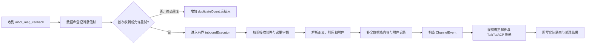

# 企微信道消息记录与检索方案

> 状态：核心功能已实现（2026-09-06）
> 范围：`WECOM_WS` 入站消息、持久化、ConfigUI 查询与附件访问
> 不在本期：Agent 回复归档、企微事件回调归档、消息重放、外部审计 API

当前实现已经覆盖：消息先登记再投递、SQLite 持久化去重、正文/直接引用/附件归档、
脱敏原始 payload、处理结果回写、服务端字段检索与分页、详情/附件 API，以及信道卡片的
消息记录弹窗。混排 part 的显式顺序表、实际 Team owner 投递快照、自动保留期清理与已删除
信道档案入口仍作为后续增强项；当前混排结构可从脱敏 payload 详情保留，弹窗展示解析后的
正文、引用和当前/引用附件。

## 1. 背景与目标

当前企微入站链路为：

```text
WeCom WebSocket
  -> WeComChannelAdapter
  -> WeComInboundMessageParser（解析正文、直接引用和附件）
  -> ChannelEvent
  -> ChannelTalkToBridge
  -> TalkTo inbox / ACP
```

这条链路只保留运行时投递所需的数据：

- `msgid` 去重状态仅存在内存，进程重启后丢失；
- 消息没有独立数据库记录；
- 附件解密后只暂存到绑定 Agent 的 workspace；
- 引用只保留一层，当前模型仅表达引用类型和引用文本；
- 被接收策略拦截、暂不支持、解析失败、媒体下载失败、绑定失败或队列拒绝的消息不会形成可查询记录；
- ConfigUI 的信道卡片没有消息历史入口。

本期目标：

1. 每个企微信道收到的消息先持久化，再进入现有解析和投递链路。
2. 记录足够完整的协议、会话、发送者、正文、直接引用、混排内容、附件和处理结果。
3. 在消息渠道卡片上提供“消息记录”按钮，点击后打开宽屏弹窗。
4. 弹窗使用服务端分页，并支持按独立字段组合检索。
5. 不改变现有企微回复路由、Team 成员选择、队长模式和 ACP 投递语义。
6. 数据归属于当前 cmd-proxy 实例；ConfigUI 切换环境时仍通过现有 `instance` 代理查询目标实例。

## 2. 核心设计结论

### 2.1 记录点必须位于策略和去重之前

消息记录不能放在 `ChannelTalkToBridge.onEvent` 后面。正确顺序是：



这样以下消息也能被看到：

- `inboundEnabled=false` 或单聊接收关闭；
- `msgtype` 暂不支持；
- 必要字段缺失；
- 附件下载或解密失败；
- inbound executor 已满；
- ACP 绑定不可用；
- TalkTo inbox 已满；
- 仅附件消息被保存但没有触发 ACP。

数据库登记失败时采用 **fail closed**：不写内存去重、不投递给 ACP，记录结构化错误并允许企微重投。否则会出现“Agent 已处理、审计库却没有记录”的不可修复分叉。

### 2.2 消息和附件分开保存

- 消息、正文、引用、附件元数据、处理状态和检索字段保存在 SQLite。
- 解密后的附件二进制保存在当前实例受控目录，不放入 SQLite BLOB。
- SQLite 中只保存服务端生成的 `attachmentId`、内容摘要、大小、MIME 和不可由客户端指定的 `storageKey`。

原因：现有企微媒体下载允许最高约 50 MiB 的加密响应；大 BLOB 会显著放大 SQLite 事务、WAL、备份和分页查询成本。附件文件仍属于消息档案的一部分，并通过外键元数据和受限下载接口访问。

建议路径：

```text
${CMD_PROXY_HOME}/channels/messages/messages.db
${CMD_PROXY_HOME}/channels/messages/attachments/<sha256-prefix>/<sha256>
${CMD_PROXY_HOME}/channels/messages/tmp/
```

附件写入采用“临时文件 -> 校验 SHA-256/大小 -> 原子移动 -> 短事务写元数据”。崩溃最多留下可清理的孤立文件，不允许数据库记录指向尚未完成的临时文件。

### 2.3 使用稳定的信道档案标识

不能只用可编辑的 `channel.id` 作为历史归属键。给 `ChannelConfig` 增加内部字段 `archiveId`：

- 新建信道时由服务端生成 UUID；
- 老配置首次加载时补齐并持久化；
- 重命名信道时保持不变；
- 消息同时保存 `archive_id` 和接收时的 `channel_id` 快照；
- 删除信道默认不删除历史和附件。

ConfigUI 卡片按 `archiveId` 查询，因此信道重命名后仍能查看旧消息。删除后的孤立档案本期不在 UI 展示，后续可增加“已删除信道档案”管理入口。

## 3. 数据模型

数据库独立使用 `messages.db`，不与任务库混表。启用 `foreign_keys=ON`、`journal_mode=WAL`、`busy_timeout=5000`，迁移只增量创建或扩展结构，禁止通过删库修复。

### 3.1 `channel_message`

一行代表一条企微逻辑消息。建议字段如下：

| 字段 | 类型 | 说明 |
|---|---:|---|
| `id` | TEXT PK | 服务端 UUID，不暴露数据库 rowid |
| `archive_id` | TEXT NOT NULL | 稳定信道档案 ID |
| `channel_id` | TEXT NOT NULL | 接收当时的信道名称快照 |
| `provider` | TEXT NOT NULL | 固定为 `WECOM`，为后续信道扩展留边界 |
| `provider_message_id` | TEXT | 企微 `msgid`；合法消息的持久化幂等键 |
| `callback_command` | TEXT | `aibot_msg_callback` |
| `request_id_digest` | TEXT | `req_id` 的 SHA-256，不延长原始回复能力的存活期 |
| `first_received_at` | INTEGER NOT NULL | 首次接收毫秒时间戳 |
| `last_received_at` | INTEGER NOT NULL | 最近一次重复接收时间 |
| `provider_created_at` | INTEGER | 上游提供时保存，否则为空 |
| `duplicate_count` | INTEGER NOT NULL | 首次为 0，后续同 `msgid` 累加 |
| `chat_type` | TEXT | `single` / `group` / 原始未知值 |
| `chat_id` | TEXT | 群聊 ID；单聊按上游实际字段保存 |
| `chat_name` | TEXT | 群名或协议提供的会话名 |
| `sender_id` | TEXT | `from.userid` |
| `sender_name` | TEXT | `from.name` |
| `sender_alias` | TEXT | `from.alias` |
| `message_type` | TEXT | `text` / `voice` / `image` / `file` / `mixed` / 未知值 |
| `text_content` | TEXT | 当前消息归一化文本，保留换行 |
| `quote_type` | TEXT | 直接引用的消息类型 |
| `quote_text` | TEXT | 直接引用的归一化文本 |
| `sanitized_payload_json` | TEXT NOT NULL | 去除媒体 URL、AES key 和未知凭据后的回调 body，用于展示未建模字段 |
| `parse_status` | TEXT NOT NULL | `RECEIVED/PARSED/UNSUPPORTED/INVALID/MEDIA_FAILED/ARCHIVE_FAILED` |
| `delivery_status` | TEXT NOT NULL | `PENDING/DELIVERED/SAVED_ONLY/IGNORED_POLICY/BINDING_REJECTED/QUEUE_REJECTED/FAILED` |
| `result_code` | TEXT | 稳定机器码，例如 `CHANNEL_INBOUND_DISABLED` |
| `result_detail` | TEXT | 截断并脱敏后的失败原因 |
| `binding_type` | TEXT | 实际解析时的 `MAIN` / `TEAM_MEMBER` |
| `bound_group_id` | TEXT | MAIN 绑定目标快照 |
| `bound_team_id` | TEXT | Team 目标快照 |
| `selected_team_member_id` | TEXT | 自动或固定路由后实际选中的成员 |
| `selected_owner_key` | TEXT | 本次实际 owner 的稳定键或其摘要 |
| `attachment_count` | INTEGER NOT NULL | 当前消息与直接引用附件总数 |
| `attachment_bytes` | INTEGER NOT NULL | 解密后附件总大小 |
| `processed_at` | INTEGER | 进入终态的时间 |
| `updated_at` | INTEGER NOT NULL | 最近状态更新时间 |

约束和索引：

```sql
CREATE UNIQUE INDEX channel_message_provider_dedup
ON channel_message(archive_id, provider_message_id)
WHERE provider_message_id IS NOT NULL AND provider_message_id <> '';

CREATE INDEX channel_message_time
ON channel_message(archive_id, first_received_at DESC, id DESC);

CREATE INDEX channel_message_sender
ON channel_message(archive_id, sender_id, first_received_at DESC);

CREATE INDEX channel_message_chat
ON channel_message(archive_id, chat_type, chat_id, first_received_at DESC);

CREATE INDEX channel_message_type_status
ON channel_message(archive_id, message_type, delivery_status, first_received_at DESC);
```

缺少 `msgid` 的非法回调也必须记录，但不建立该唯一键；其 `id` 由服务端生成。

### 3.2 `channel_message_part`

当前解析器会把 mixed 中的多段文本合并，并把图片提取到独立附件列表，无法还原原始顺序。新增 part 表保存可展示顺序：

| 字段 | 说明 |
|---|---|
| `id` | 服务端 UUID |
| `message_id` | 所属消息 |
| `scope` | `CURRENT` 或 `QUOTE` |
| `part_index` | 在对应 scope 内从 0 开始的顺序 |
| `part_type` | `TEXT/VOICE/IMAGE/FILE/UNKNOWN` |
| `text_content` | 文本或语音识别文本 |
| `attachment_id` | 图片或文件对应的附件 ID |
| `part_payload_json` | 脱敏后的未建模 part 字段 |

唯一约束为 `(message_id, scope, part_index)`。引用仍遵循现有产品边界：只记录回调直接携带的一层引用，不递归拉取引用链；若直接引用内部又含 `quote`，只在脱敏载荷中标记 `nestedQuoteOmitted=true`，不下载第二层附件。

### 3.3 `channel_message_attachment`

| 字段 | 说明 |
|---|---|
| `id` | 服务端 UUID，前端下载只使用该 ID |
| `message_id` | 所属消息 |
| `origin` | `CURRENT` / `QUOTE` |
| `part_index` | 对应 mixed/quote 中的位置 |
| `kind` | `IMAGE` / `FILE` |
| `file_name` | Content-Disposition 或安全回退文件名 |
| `mime_type` | 响应 MIME，缺失时为 `application/octet-stream` |
| `size_bytes` | 解密后的字节数 |
| `sha256` | 内容摘要 |
| `storage_key` | 服务端内部相对键，不通过 API 返回 |
| `archive_status` | `READY/FAILED` |
| `error_code` / `error_detail` | 下载、解密、大小或落盘失败原因 |
| `created_at` | 完成或失败时间 |

数据库列表查询严禁读取附件正文；下载接口按 `attachmentId -> storageKey` 解析，校验消息和信道归属，并确认最终路径仍位于附件根目录内。

### 3.4 脱敏规则

`sanitized_payload_json` 用于“完整描述业务消息”，不是保存凭据：

- 移除或替换所有 `aeskey`、`secret`、`token`、`authorization`、`cookie`；
- 媒体 `url` 只保存 `scheme/host/path` 的摘要或固定值 `[REDACTED_MEDIA_URL]`；
- 不保存原始 `req_id`，只保存摘要；现有内存 `ChannelReplyRoute` 继续负责限时回复；
- 未知字段递归执行大小、深度和敏感键限制；单条 JSON 设置上限，超出时保存 `payloadTruncated=true`；
- 日志只打印消息 ID、信道 ID 和稳定错误码，不打印正文、附件内容或脱敏前 payload。

## 4. 写入与状态机

### 4.1 首次接收

在 `WeComChannelAdapter.handleMessage` 的最前面调用：

```java
ChannelMessageReceipt receipt = archive.receive(
    config.getArchiveId(), config.getId(), frame);
```

`receive` 用短事务完成：

1. 提取 `msgid`、基础会话字段、发送者字段、消息类型和脱敏载荷。
2. 按 `(archiveId, msgid)` 插入；冲突时更新 `last_received_at` 和 `duplicate_count`。
3. 返回 `messageRecordId`、是否首次收到、当前状态以及是否允许重试。

内存 `seenMessages` 不再作为权威去重；可以保留为热点优化，但最终判断必须以数据库为准。进程重启后同一 `msgid` 不会重复投递。

### 4.2 可重试与终态重复

终态记录再次收到时只增加重复计数，不重复投递。以下状态允许同一 `msgid` 重试处理：

- `MEDIA_FAILED`；
- `ARCHIVE_FAILED`；
- `QUEUE_REJECTED`；
- 可明确恢复的临时内部错误。

重试必须使用数据库条件更新抢占处理权，例如 `processing_lease_until` 和 `processing_token`，避免首次回调和重投并发执行。`DELIVERED`、`SAVED_ONLY`、`IGNORED_POLICY`、`UNSUPPORTED`、`INVALID` 为终态。

### 4.3 解析和附件归档

扩展 `WeComInboundMessageParser.ParsedMessage`，同时返回：

- 当前消息归一化文本；
- 直接引用模型；
- 有序 parts；
- 已解密附件及其 `origin/partIndex`。

附件下载完成后，先写消息档案，再调用现有 `ChannelTalkToBridge`。workspace 暂存仍从内存中的 `ChannelAttachment` 生成，不允许把档案目录路径直接交给 Agent。

附件档案写入失败时不继续 ACP 投递，消息标记 `ARCHIVE_FAILED` 并允许重投补全；不能只保存附件元数据却把消息标成成功。

### 4.4 投递结果回写

`ChannelTalkToBridge.onEvent` 返回值需要扩展为携带稳定结果码和实际目标快照，或由 bridge 调用 recorder 更新：

- 成功进入 TalkTo：`DELIVERED`；
- 仅附件消息已保存到 workspace、未调用 ACP：`SAVED_ONLY`；
- 接收策略拦截：`IGNORED_POLICY`；
- 绑定目标不可用：`BINDING_REJECTED`；
- TalkTo inbox 满：`QUEUE_REJECTED`；
- 其他异常：`FAILED`。

对于 Team `RANDOM/AFFINITY/FIXED`，必须保存 **本次实际选中的** `teamMemberId/ownerKey`；队长模式仍只能记录并投递到队长，不在归档功能中重新选择成员。

## 5. 后端 API

所有接口注册到 `ConfigUiServer` 的 `proxied(...)` 包装器，继续复用现有多环境同源代理。

### 5.1 分页检索

```http
GET /api/channels/v1/messages
    ?archiveId=<uuid>
    &page=1
    &pageSize=20
    &keyword=
    &messageId=
    &senderId=
    &senderName=
    &chatType=
    &chatId=
    &chatName=
    &messageType=
    &content=
    &quote=
    &attachmentName=
    &mimeType=
    &deliveryStatus=
    &receivedFrom=
    &receivedTo=
```

规则：

- `archiveId` 必填，服务端确认它属于当前实例已知或历史信道档案；
- `page >= 1`，`pageSize` 仅允许 `10/20/50/100`，默认 20；
- ID、枚举字段默认精确匹配；名称、正文、引用和附件名使用转义后的参数化 `LIKE`；
- 多字段之间为 AND；`keyword` 在消息 ID、发送者、会话、正文、引用和附件名之间做 OR；
- 所有值限制长度，日期范围校验先后关系，SQL 只使用占位符；
- 数据按 `first_received_at DESC, id DESC` 稳定排序；
- 同一过滤条件分别执行 `COUNT(*)` 和当前页查询，响应 `page/pageSize/total/totalPages/items`；
- 列表 SQL 不选择 `sanitized_payload_json` 和附件正文，避免放大响应。

第一版不引入 FTS5。独立字段索引覆盖常用精确过滤，正文等包含检索使用 `LIKE`；这能正确支持中文子串，也避免依赖 FTS tokenizer。数据规模证明需要后，再增加可迁移、可回建的全文索引。

响应摘要示例：

```json
{
  "ok": true,
  "data": {
    "page": 1,
    "pageSize": 20,
    "total": 1,
    "totalPages": 1,
    "items": [
      {
        "id": "local-message-uuid",
        "messageId": "wecom-msgid",
        "receivedAt": 1788661200000,
        "chat": {"type": "group", "id": "chat-id", "name": "研发群"},
        "sender": {"id": "zhangsan", "name": "张三", "alias": "zs"},
        "messageType": "mixed",
        "textContent": "请看这张图",
        "quote": {"messageType": "text", "text": "上一条消息"},
        "attachments": [{"id": "att-uuid", "origin": "CURRENT", "kind": "IMAGE", "fileName": "image.png", "mimeType": "image/png", "size": 12345, "status": "READY"}],
        "delivery": {"status": "DELIVERED", "resultCode": null, "teamMemberId": "member-1"},
        "duplicateCount": 0
      }
    ]
  }
}
```

### 5.2 单条详情

```http
GET /api/channels/v1/messages/{messageRecordId}?archiveId=<uuid>
```

返回列表摘要之外的 ordered parts、完整直接引用、脱敏 payload、处理时间线和失败详情。服务端必须同时匹配 `messageRecordId + archiveId`，禁止跨信道枚举。

### 5.3 附件访问

```http
GET /api/channels/v1/messages/{messageRecordId}/attachments/{attachmentId}
    ?archiveId=<uuid>
```

- 同时校验 `archiveId`、`messageRecordId`、`attachmentId` 的关系；
- 只从数据库解析服务端 `storageKey`，拒绝客户端路径和 URL；
- 文件名进行 Content-Disposition 编码；
- 默认 `attachment` 下载，可信图片预览可显式使用 `disposition=inline`；
- 响应设置 `X-Content-Type-Options: nosniff`；
- inline 只允许 `image/png`、`image/jpeg`、`image/gif`、`image/webp`，SVG/HTML 始终下载；
- 支持流式输出，不把整个附件再次载入堆内存；
- 跨实例图片或下载 URL 必须附带当前 `instance` 参数，使现有代理把请求送到正确实例。

建议错误格式统一为：

```json
{"ok": false, "code": "MESSAGE_NOT_FOUND", "message": "消息不存在"}
```

## 6. ConfigUI 交互

### 6.1 入口

在每张消息渠道摘要卡片的操作区新增按钮：

```text
[消息记录] [刷新] [编辑] [删除]
```

桌面端可显示 `history` 图标和 title；移动端只显示图标。按钮使用信道的稳定 `archiveId`，不依赖当前列表索引或可变 channel ID。

### 6.2 弹窗布局

复用现有“摘要卡片 + 宽屏弹窗”交互规范：

- 桌面端宽度建议 `min(1180px, calc(100vw - 48px))`，高度 `min(820px, calc(100dvh - 48px))`；
- 移动端使用近全屏或全屏；
- 打开弹窗后锁定页面滚动并阻止滚轮穿透；
- header 展示信道名称、总记录数和刷新按钮；
- 筛选区固定在弹窗上方，结果列表独立滚动；
- 初次加载、翻页、检索、空结果和失败均有明确状态；
- 切换实例或关闭弹窗时取消旧请求语义，使用 request token 丢弃迟到响应。

筛选区分为“快捷检索”和“更多字段”：

- 快捷检索：关键字、消息类型、处理状态、时间范围；
- 更多字段：消息 ID、发送者 ID/名称、会话 ID/名称、单聊/群聊、正文、引用正文、附件名、MIME。

输入检索使用约 300 ms debounce；任一条件变化后回到第 1 页。分页提供每页 10/20/50 条以及上一页、页码、下一页。

### 6.3 消息展示

每条记录默认展示：

- 接收时间、单聊/群聊、消息类型、处理状态；
- 发送者名称和 ID、会话名称和 ID；
- 当前消息正文，按纯文本安全转义并保留换行，不把外部输入当可信 Markdown；
- 引用块，明确标记“引用消息”和引用类型；
- 按原始顺序展示 mixed parts；
- 附件以文件 chip 展示名称、类型、大小和来源（当前消息/引用）；图片可加载缩略预览，其他文件提供下载；
- 实际投递目标以及失败原因。

“查看详情”展开技术信息：企微 `msgid`、重复次数、解析/投递时间线和格式化后的脱敏 payload。技术字段默认折叠，避免普通用户被原始 JSON 干扰。

本期不使用 SSE。弹窗打开和用户点击刷新时读取最新数据；分页数据不会因新消息插入而主动跳页。

## 7. 类与接线建议

建议新增：

```text
acp/channel/archive/
├── ChannelMessageArchive.java          # 用例入口：receive/complete/fail/query
├── ChannelMessageRepository.java       # SQLite 短事务和参数化查询
├── ChannelMessageMigrationRunner.java  # 独立 schema 迁移
├── ChannelAttachmentArchive.java       # 受限附件落盘、摘要与读取
├── ChannelPayloadSanitizer.java         # 递归脱敏和大小限制
├── ChannelMessageQuery.java             # API 查询参数模型
└── model/
    ├── ChannelMessageReceipt.java
    ├── ChannelMessageRecord.java
    ├── ChannelMessagePart.java
    └── ChannelArchivedAttachment.java

acp/channel/api/
├── ChannelMessageApiBridge.java         # 让 ConfigUI 每次请求取得当前实例服务
└── ChannelMessageRestHandler.java       # list/detail/download
```

现有文件的主要修改点：

| 文件 | 修改 |
|---|---|
| `ChannelConfig` / `ChannelConfigFileStore` | 增加并保留稳定 `archiveId`，兼容老配置和 Secret 掩码写回 |
| `WeComFrame` / `WeComProtocol` | 向归档入口提供受控的消息信封字段，不直接暴露凭据 |
| `WeComChannelAdapter` | 在策略、去重和异步队列前登记；解析/失败后更新状态 |
| `WeComInboundMessageParser` | 输出有序 parts、引用和附件位置，不再只返回折叠文本 |
| `ChannelAttachment` | 增加稳定附件 ID 或 part index 等归档所需元数据 |
| `ChannelTalkToBridge` / 投递结果模型 | 回传稳定结果码和本次实际 owner 快照 |
| `ChannelManager` | 注入进程级 archive；热重载只替换 adapter，不关闭数据库 |
| `AcpProxy` / `Main.kt` | 初始化和关闭 archive，接入 ConfigUI 查询服务 |
| `ConfigUiServer` | 注册 proxied list/detail/download 路由 |
| `configui/index.html` | 卡片按钮、筛选弹窗、服务端分页和安全附件展示 |

生命周期要求：

- archive 属于 **进程/实例**，不属于某个 WebSocket adapter；
- 单信道刷新或 ACP 热重载不能关闭消息库；
- ConfigUI 查询每次通过 bridge 解析当前可用服务，不能持有已关闭 repository；
- 进程退出时先停止信道接收，再关闭 archive；
- 数据库事务中禁止执行媒体下载、文件流输出、ACP 调用或跨 RPC 回调。

## 8. 容量与保留策略

第一版默认不自动删除消息，避免在产品未确认保留期前静默丢历史。实现时同时提供可观测性：

- 数据库文件大小；
- 附件总大小和数量；
- 最早/最近消息时间；
- 归档失败计数。

预留实例级配置但默认关闭：

```json
{
  "channelMessageArchive": {
    "retentionDays": 0,
    "maxAttachmentBytes": 52428800
  }
}
```

`retentionDays=0` 表示永久保留。后续启用清理时必须按精确消息 ID 分批删除：先标记、再删除无引用附件、最后 checkpoint/VACUUM；不得通过删除整个数据库或附件目录清理。

## 9. 兼容性与失败处理

- 老信道配置自动补 `archiveId`，不改变现有 `id/botId/secret/binding`。
- 已存在的 workspace inbox 文件不反向导入；上线后新收到的消息开始归档。
- 不支持的 `msgtype` 仍保存脱敏 payload 并显示 `UNSUPPORTED`，未来 parser 支持后不自动重放。
- 附件失败记录文件名/类型等已知元数据和稳定错误码，不保存媒体 AES key 或临时下载 URL。
- 数据库暂时忙时由 `busy_timeout` 吸收短抖动；超时后 fail closed，让上游重投。
- UI 查询失败不影响 WebSocket 接收；写入失败不应被 UI 查询锁长期阻塞。
- ConfigUI 删除信道不级联删除消息档案；修改绑定只影响后续消息，新旧消息分别保留实际投递快照。

## 10. 测试与验收

### 10.1 存储与迁移测试

- 空目录创建数据库、重复启动迁移幂等、较新 schema 拒绝降级写入；
- 同一 `(archiveId, msgid)` 重复只形成一条逻辑消息并累计重复数；
- 进程重启后重复消息不再次投递；
- 信道重命名后 `archiveId` 不变且历史仍可查询；
- mixed 文本/图片顺序、直接引用文本/图片/文件、纯附件消息完整保存；
- 附件 SHA-256、大小、文件名、MIME 和 origin 正确；
- 临时写失败、原子移动失败和数据库失败不会产生“已成功但附件缺失”的记录；
- payload 脱敏不泄露 URL、AES key、Secret、Token 或 Cookie。

### 10.2 入站链路测试

- 正常文本、语音、图片、文件、mixed 均记录并保持原有投递行为；
- `inboundEnabled=false`、单聊关闭、缺少字段、不支持类型仍可查询；
- 媒体下载/解密失败、executor 满、绑定不存在、TalkTo inbox 满均回写准确状态；
- `RANDOM/AFFINITY/FIXED` 保存实际成员；队长模式只出现队长；
- 数据库写入失败时不投递、不污染去重，后续重投可恢复；
- Starweave 事件投影和现有附件 workspace 暂存不出现重复展示或重复落盘。

### 10.3 API 与安全测试

- 每个字段单独过滤、多个字段组合、中文包含检索、日期边界和稳定分页；
- `%`、`_`、反斜杠和 SQL 注入输入只作为普通检索值；
- page/pageSize/字符串长度/日期范围非法时返回 400；
- message/attachment 必须同时属于请求 `archiveId`；
- 路径逃逸、符号链接逃逸、任意 URL 和伪造 storageKey 均被拒绝；
- HTML/SVG 强制下载，图片 inline 白名单和 `nosniff` 正确；
- 本地与跨实例代理的 list/detail/download 都访问正确实例。

### 10.4 UI 验收

- 所有企微信道卡片都有消息记录按钮；
- 弹窗宽度、移动端、独立滚动、滚轮隔离和关闭后的页面滚动恢复正常；
- 加载、空结果、失败、翻页和字段检索状态清晰；
- 正文、引用、mixed 顺序、当前/引用附件和处理失败原因展示完整；
- 外部消息中的 HTML 不执行，文件名和 payload 不破坏 DOM；
- 快速连续检索、切换实例、关闭再打开时，迟到响应不会覆盖当前弹窗；
- 运行内联 JavaScript 语法检查，并在真实浏览器中验收，而不只依赖字符串契约测试。

### 10.5 建议验证顺序

```bash
mvn -pl cmd-proxy-app -Dtest=ChannelMessageRepositoryTest,ChannelMessageArchiveTest test
mvn -pl cmd-proxy-app -Dtest=WeComInboundMessageParserTest,ChannelAttachmentInboundTest,ChannelInboundDeliveryTest test
mvn -pl cmd-proxy-app -Dtest=ChannelMessageHttpTest,ConfigUiLayoutContractTest test
mvn -pl cmd-proxy-app test
mvn -pl cmd-proxy-app -DskipTests package
git diff --check
```

最后使用真实企微机器人完成文本、群聊、引用、图片、文件、mixed、重复投递和媒体失败验收，并分别在本地实例与 ConfigUI 跨实例切换场景中检查弹窗。

## 11. 实施拆分

建议按以下顺序小步落地，每一步都保持可测试：

1. **存储基础**：schema、repository、附件受限存储、脱敏器、稳定 `archiveId`。
2. **写入链路**：adapter 先登记、持久化去重、parser ordered parts、状态回写。
3. **查询接口**：服务端字段过滤、分页、详情和附件下载，接入多实例代理。
4. **ConfigUI**：信道卡片按钮、宽屏弹窗、字段检索、详情和附件展示。
5. **完整回归**：异常状态、重启去重、Team 实际 owner、浏览器与真实企微验收。

完成标准不是“正常文本能显示”，而是：所有到达 `aibot_msg_callback` 的消息均有一条可解释的数据库记录，内容与直接引用/附件可查看，且每条记录都能说明它最终被投递、仅保存、忽略、拒绝还是失败。
